**EEG Spectrogram Analysis**

**Table of Contents**
- [Introduction](#introduction)
- [Electroencephalography (EEG) 101](#electroencephalography-eeg-101)
  - [Types of EEG electrode setups.](#types-of-eeg-electrode-setups)
    - [**The international 10-20 system** of electrode montage uses letters and numbers to identify electrodes using letters and numbers; letters for identifying skeletal region (e.g., f for frontal), and numbers for identifying hemisphere (odds on the left, evens on the right). There are some exceptions for the naming system (see figure below). Together, the 19 electrodes are evenly spaced at 10% and 20% intervals from corners and regions of the skull, based on certain skeletal landmarks.](#the-international-10-20-system-of-electrode-montage-uses-letters-and-numbers-to-identify-electrodes-using-letters-and-numbers-letters-for-identifying-skeletal-region-eg-f-for-frontal-and-numbers-for-identifying-hemisphere-odds-on-the-left-evens-on-the-right-there-are-some-exceptions-for-the-naming-system-see-figure-below-together-the-19-electrodes-are-evenly-spaced-at-10-and-20-intervals-from-corners-and-regions-of-the-skull-based-on-certain-skeletal-landmarks)
    - [Bipolar Montage 1: Setup](#bipolar-montage-1-setup)
    - [**Phase Reversal.**](#phase-reversal)
    - [Referential Montages](#referential-montages)
    - [Page speed (EEG display settings)](#page-speed-eeg-display-settings)
- [Section 1- Spectrogram Analysis 101 (Overview)](#section-1--spectrogram-analysis-101-overview)
  - [Spectrogram](#spectrogram)
    - [Sleep Staging](#sleep-staging)
- [Wave Properties](#wave-properties)
- [Section XX: Periodogram and Fourier Analysis](#section-xx-periodogram-and-fourier-analysis)
  - [Periodogram Bias](#periodogram-bias)
  - [Improving Bias](#improving-bias)
  - [Multi-taper Spectral Analysis](#multi-taper-spectral-analysis)
    - [Multi-taper spectrum parameters](#multi-taper-spectrum-parameters)
- [Setting up EEG Analysis in Python](#setting-up-eeg-analysis-in-python)
  - [Python Dependencies](#python-dependencies)
- [Importing Data](#importing-data)
    - [EEG.edf file](#eegedf-file)
    - [Hypnogram](#hypnogram)
  - [Pre-processing Data](#pre-processing-data)
  - [Spectral Analysis](#spectral-analysis)
  - [Sleep Spindle Analysis](#sleep-spindle-analysis)
  - [Repairing Artifact](#repairing-artifact)
    - [Sleep Profiler Study Editor Tool](#sleep-profiler-study-editor-tool)
- [References](#references)


# Introduction
This walkthrough is meant to guide you through how to generate the following images (and subsequent results) from Sleep Profiler at-home EEG data (csv + edf files) using Python libraries (MNE and YASA). 

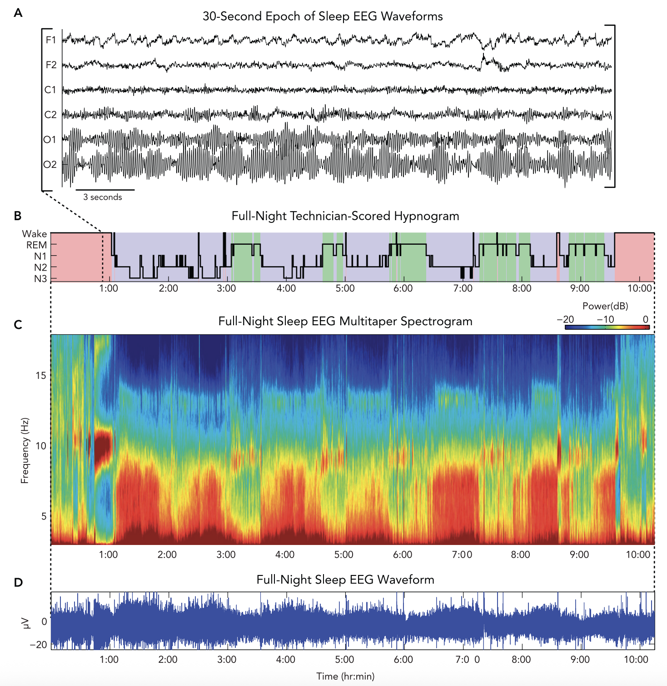

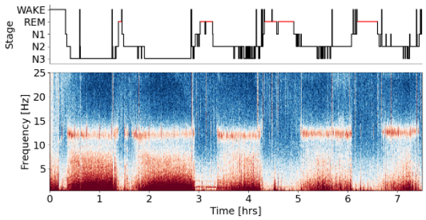

# Electroencephalography (EEG) 101
Electroencephalography (EEG) is the non-invasive measurement of the brain's electric fields, captured as a sinusoidal wavelength. Electrodes placed on the head/scalp detect and record voltage potentials (excitatory post-synaptic potentials, ESPs) resulting from the coordinated firing of cortical and sub-cortical neurons of the brain. 

The voltage or strength (amplitude, μV) of these coordinated action potentials detected and the number of waves detected in one second (frequency, Hz). There are other properties of these wavelengths, which will be mentioned in the later section on Waveform properties (Section XX).

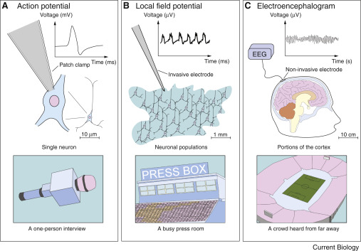

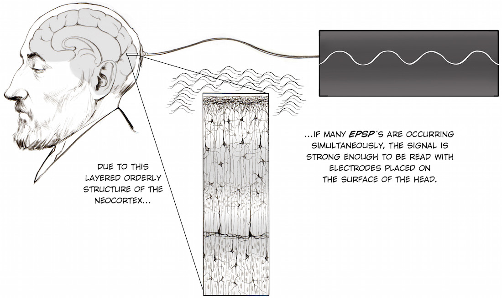

## Types of EEG electrode setups.

For an excellent, detailed (and free) course on all things EEG, check out [LeaningEEG.com](https://www.learningeeg.com/physiology-terminology) which is heavily referenced during this section of this SOP. Much appreciation to the authors of this site.

For the **"need to know" and then some 'mo**, see below:

In EEG, The detection of individual discharges across the scalp is done by connecting the electrodes in what is termed a **montage**, and there are two broad EEG montage categories:
- Bipolar
- Referential

Understanding the 'how' EEG captures data will ultimately help with understanding the analysis of EEG data when determining EEG channels to include for analysis. Also, a lot of the documentation referenced for this walkthrough was geared toward cap-based EEG set-ups (e.g., 10-20 or 10-10 montage electrode systems).

### **The international 10-20 system** of electrode montage uses letters and numbers to identify electrodes using letters and numbers; letters for identifying skeletal region (e.g., f for frontal), and numbers for identifying hemisphere (odds on the left, evens on the right). There are some exceptions for the naming system (see figure below). Together, the 19 electrodes are evenly spaced at 10% and 20% intervals from corners and regions of the skull, based on certain skeletal landmarks.

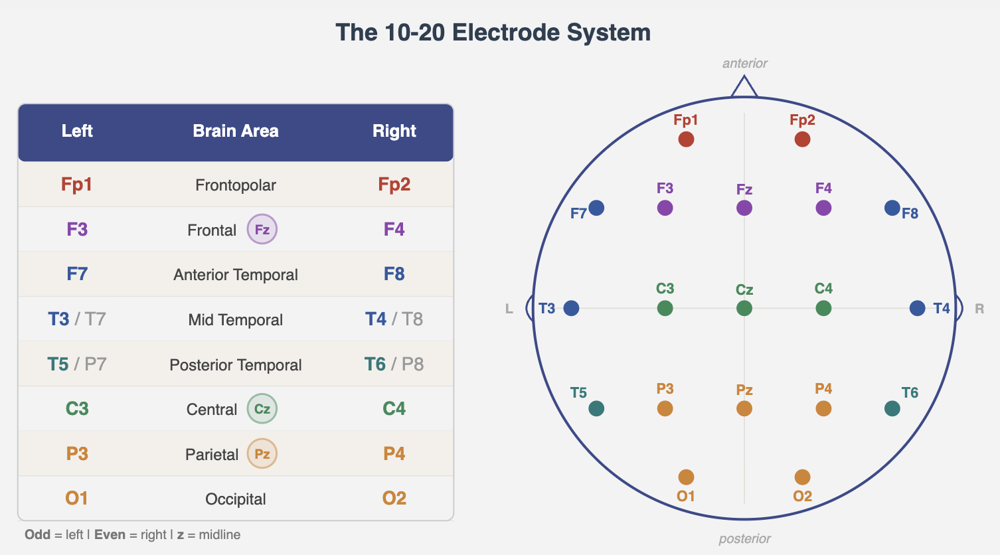

There is also a newer 10-10 electrode montage set-up, which is simply more electrodes interspersed at 10% intervals across the skull.

### Bipolar Montage 1: Setup
In a **bipolar montage**, each electrode's voltage is linked and compared to an adjacent electrode to form a chain of electrodes. The most commonly used montage configuration in EEG is the longitudinal bipolar montage, affectionately named the "double banana" montage.

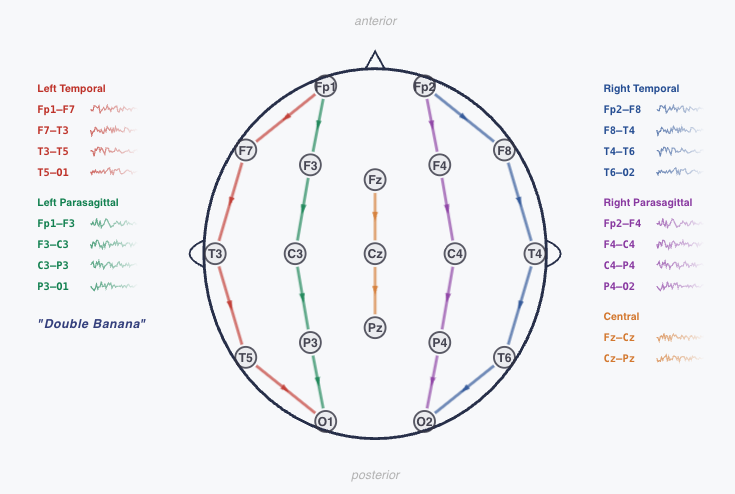

In each electrode chain, an electrode's individual voltage is compared to that of the electrode behind it, so each tracing line is a pair of electrodes in which the voltage of the second electrode is subtracted from the voltage of the first. 

Because of this, **in bipolar configurations, if the first electrode in the tracing line is more positive/higher than the second, you get a positive, downward deflection. If the second electrode is more positive/higher, you get a negative/ upward deflection.**

**For example,** if the Fp2 electrode has a voltage of -50μV and F8 has a voltage of -20μV, the Fp2-F8 tracing (how the electrode pairs are referenced, by the way) would show a voltage of -50 - (-20) = -30μV

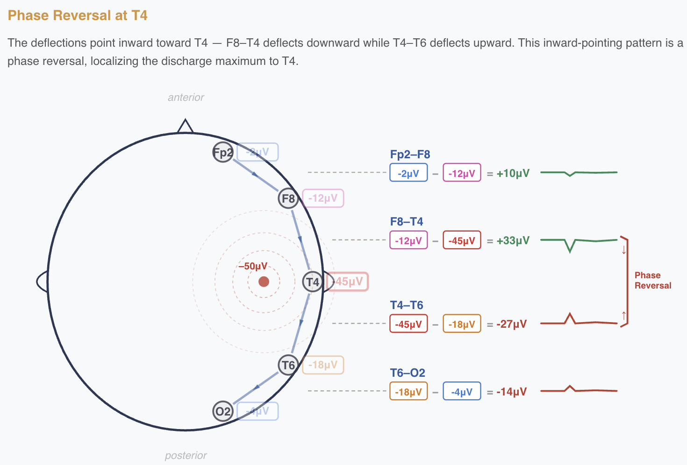

### **Phase Reversal.** 
Notice in the picture above the **phase reversal** at T4 where the greatest charge occurred when a positive charge was followed by a negative charge, causing the tracings from downward (+) to upward (-). This phenomenon is why bipolar montages are so popular.

With phase reversals, the middle electrode of the pair that makes the reversal is the electrode of maximum voltage (e.g, T3-T5 and T5-O1 phase reversal means that T5 has the greatest voltage of them all.)

Negative discharges cause the surrounding tracings to point toward the electrode of maximum voltage, while positive discharges cause surrounding tracings to point away from the electrode of maximum voltage (an easy way to remember this: positive can fit a plus sign, and negatives can only fit a negative sign.)

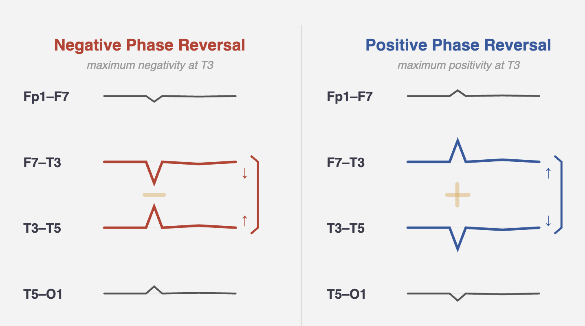

It's important to clarify that the word "positive" means different things for a deflection versus a phase reversal. 

- A single deflection's polarity is straightforward by convention: down is positive, up is negative. 
- A phase reversal's polarity names where the maximal charge sits among other channels, rather thn referring to a signel channel in isolation. So the same pair of electrodes, each carrying its own discharge can give rise to different types of phase reversals depending on how they're arranged [in a montage.]
  - A positive phase reversal is made of a negative upward deflection and a positive downward deflection that point away from one another;
  - a negative phase reversal is made of one downward (+) deflection and one upward (-) deflection that point toward one another.

So, calling a phase reversal "positive" or "negative" describes the electrode of maximal charge of either polarity, not the deflections that compose it. This distinction is especially importnat for the first and last electrodes in a montage chain, due to the **end of chain phenomenon.** Recall that, in a bipolar montage, two electrodes are compared to one another; however, the first electrode in a chain doesn't have a preceding electrode to be compared to, and the last electrode doesn't have one following to produce the inward inflection pattern needed to demonstrate a phase reversal. 

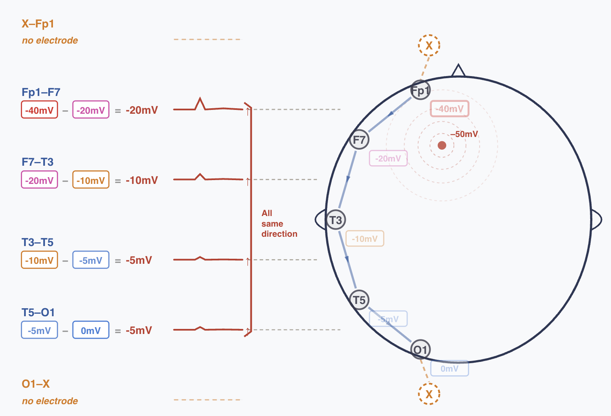

Here is an example of a normal EEG displayed in a double banana montage. 

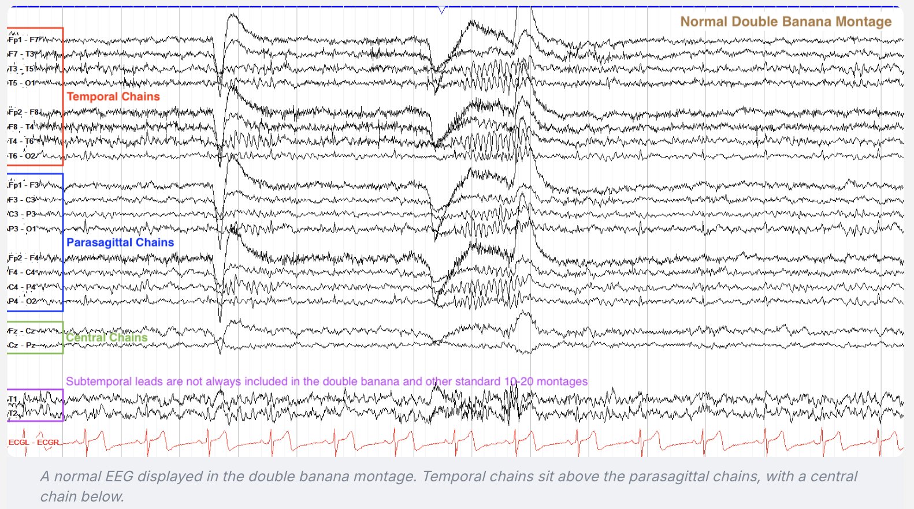

In closing this section (for brevity), recall that there are multiple types of montage setups beyond the double banana, such as the circumferential (in which the electrode pattern forms a closed loop and overcomes the end-of-chain phenomenon.) As such, the bipolar montage is a powerful and highly useful tool/setup for reading EEGs. However, bipolar montages come with caveats and requires a certain level of understanding on electrophysiology principles to fully understand/appreciate what you're seeing on an EEG. 

### Referential Montages
On an EEG, if the pont of maximum electronegatively remains unclear on a bipolar view, referential montages (as the name suggests) may be helpful as they compare all electrodes to a single reference point. The reference point can be controlled in different ways but is commonly determined as the average voltage of all electrodes (termed an **average montage**).

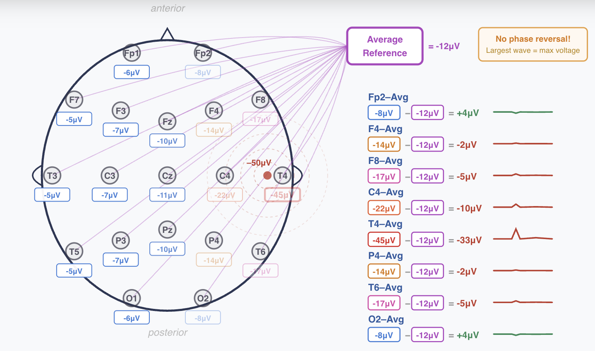

Unlike bipolar momntages, there is no phase reversal in a referential montage. Every negative elctrode produces an upward wave; the largest wave simply marks the poin of maximum voltage (T4 in the visual above). This makes referential montages simpler to read but less sensitive for screening.

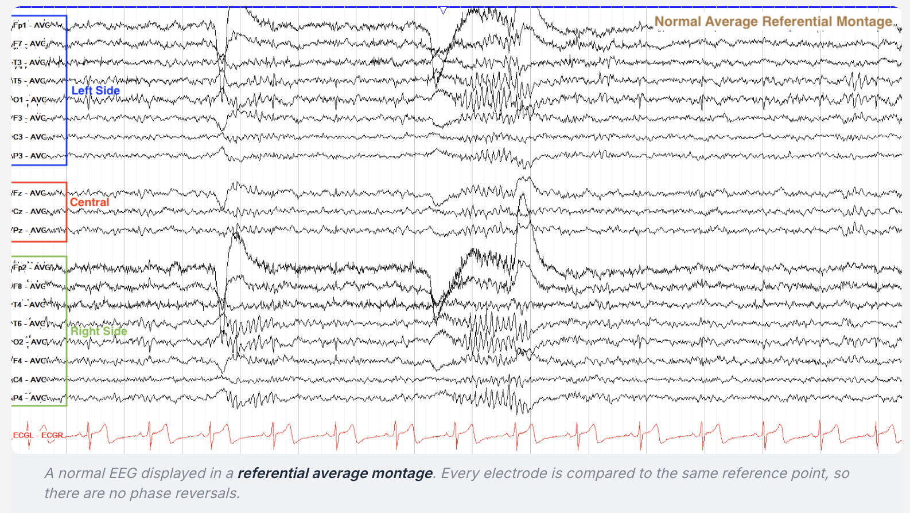

### Page speed (EEG display settings)
Formation of the EEG tracing lines is only one part of EEG. REading speed determines how many seconds of the study are displayed at one time. The standard adult reading speed is 30mm/sec and the standard neonatal speed is 15 mm/sec. 

The higher the reading speed, the fewer seconds are displayed on the screen at one time, and the more "stretched out" the EEG waves appear. When EEG is/was recorded by ink and paper on a continuous stream of paper, page speed would dictate how stretched out the EEG waves appeared (see image below). 

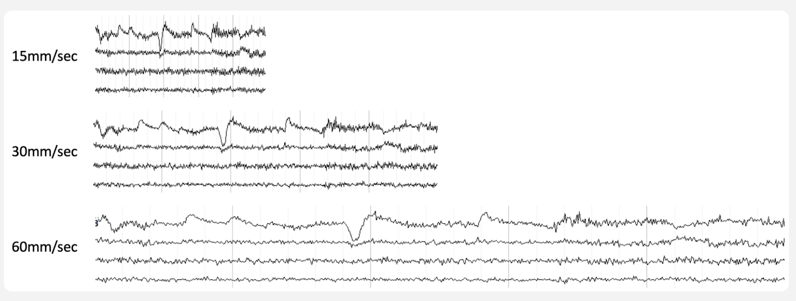

In practical terms, syncing up the **Timescale** of both the Sleep Profiler Study Editor Tool, and the EDFBrowser (used for viewing raw EEG data), will allow you to identify what EEG.edf file channels correspond to what Sleep Profile Study Editor Tool channels. This is critical for ensuring that data channels are properly identify in  Python or whatever program you will be using to perform EEG macro- and micro-structural analysis. 30 seconds per page 


# Section 1- Spectrogram Analysis 101 (Overview)

Spectral estimation (SE) is a technique for analyzing any signal comprised of oscillation waves. SE quantitatively breaks down a waveform signal in terms of all the different frequencies that comprise the waveform as well as their respetive oscillatory power (amplitude).

**Example:** White light is a waveform comprised of different colors (ROYGBIV) and their respective wavelengths. Sound is composed of different wavelengths at different frequencies that come together to produce the various parts of music/sound that you hear. 

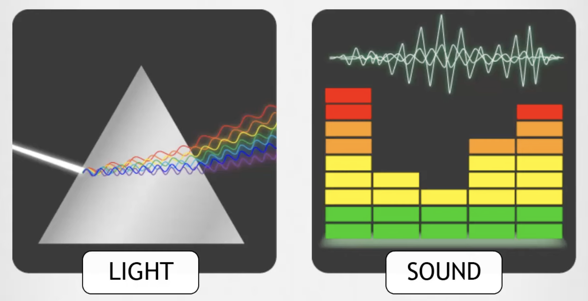

Spectral estimation operates under the assumption that any oscillatory waveform signal can be broken up into the pure sine waves of different frequencies that make up that waveform.

Converting a waveform from the time domain to the frequency domain and into its individual frequencies is often done using Fourier analysis (i.e., Fast Fourier Transformation (FFT)). See the section on Periodograms for more on FFT.

Here is a diagram of a stationary signal and the individual waveforms that comprise the signal (1, 3, 8 Hz) and their depiction in the frequency domain, shown in the "Power Spectrum." (top graph). 

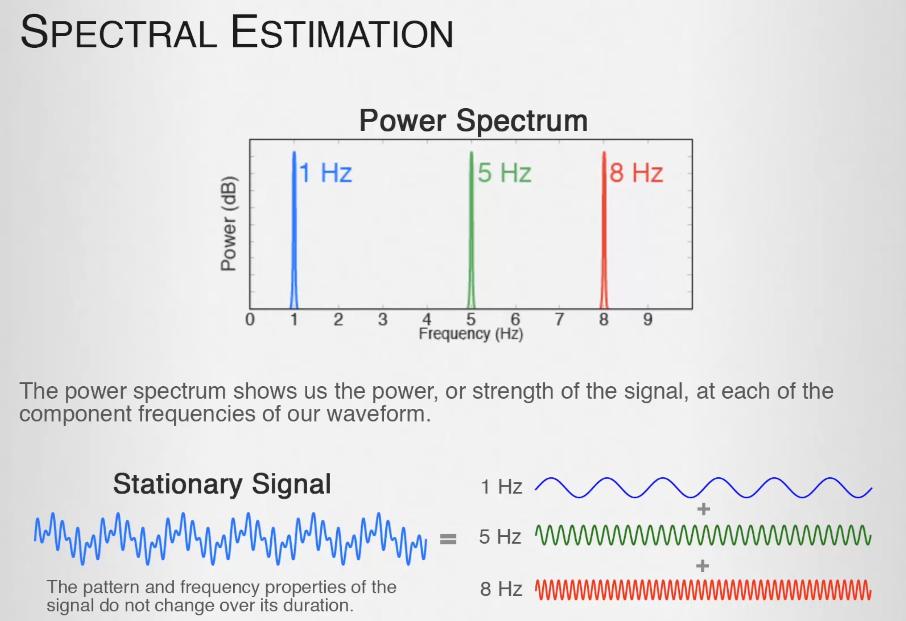

**Note:** stationary signals are clean and easy to view, but the real-world rarely provides such clean parameters. It is more likely the waveforms being dealt with are "dynamic" or non-stationary (i.e., non-uniform frequency and amplitude in an EEG waveform across time).

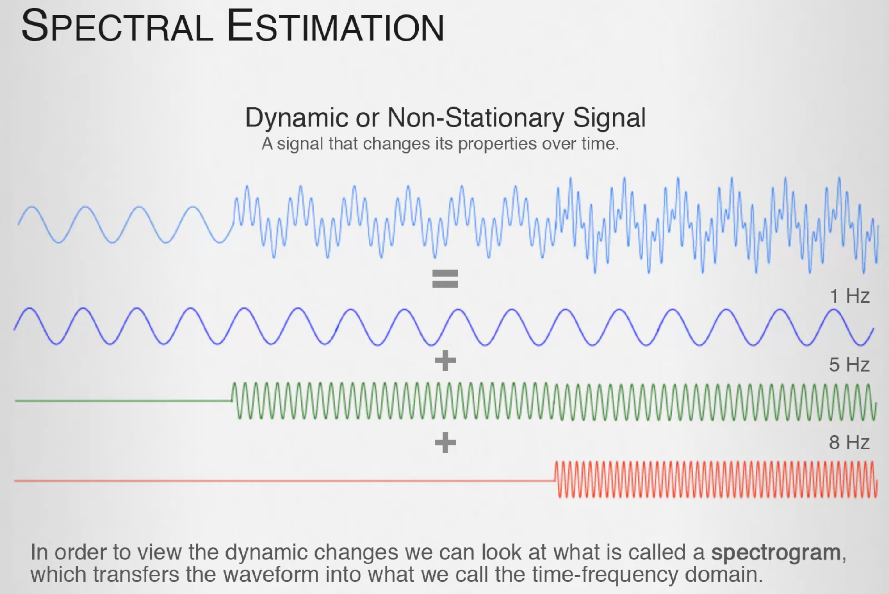

In order to view the dynamic changes of waveforms, we use what is known as a **Spectrogram**, which transfers the waveform(s) into what is known as the **time-frequency domain**.

## Spectrogram

In a spectrogram:
- X-axis represents time
- Y-axis represents frequency
- Color represents power (dB)

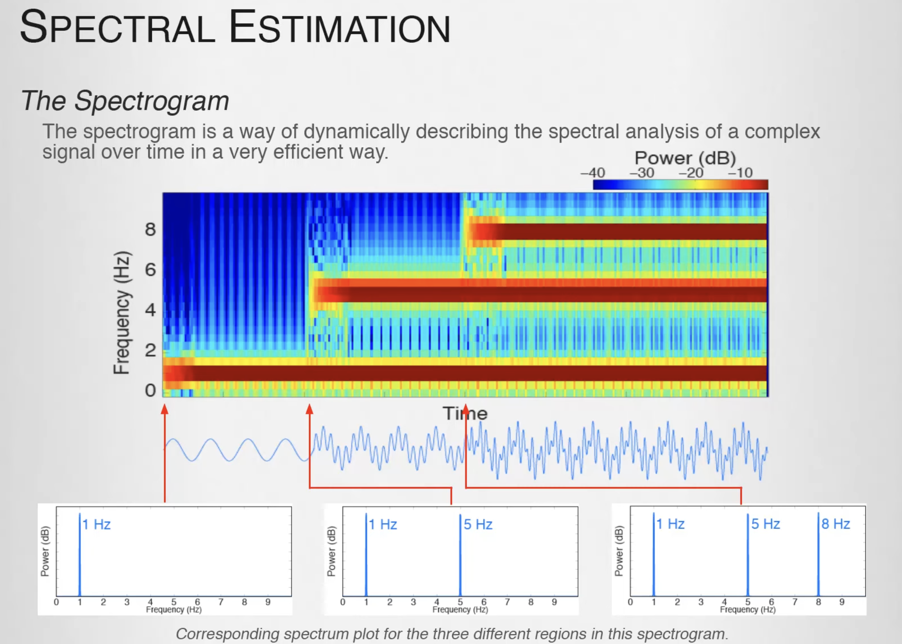

Here is a both a spectrogram and hypnogram representation of a full night's sleep.

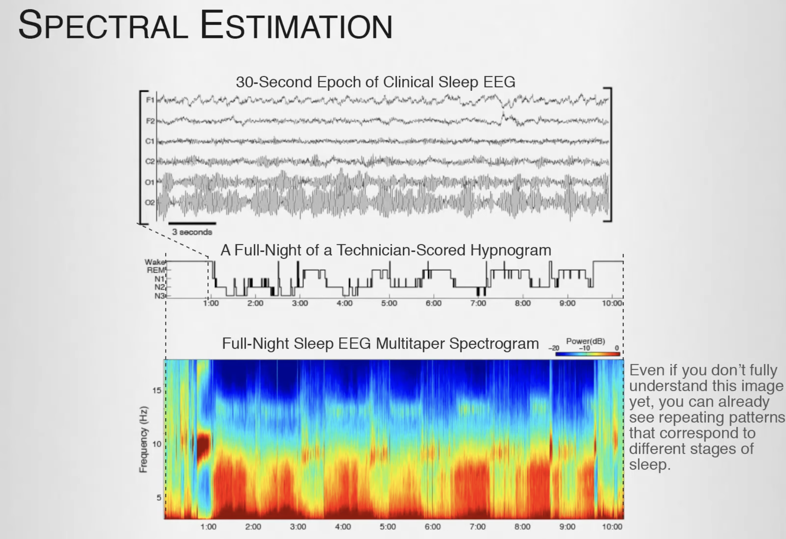

Building on this, one distinct advantage of spectral analysis beyond using a hypnogram is dealing with signal artifact. Whereby EEG signal artifact might interfere with the ability to provide a sleep score to a 30-s hynpogram epoch, the spectrogram can display both the artifact frequency and the underlying frequencies, preventing this data from being discarded.

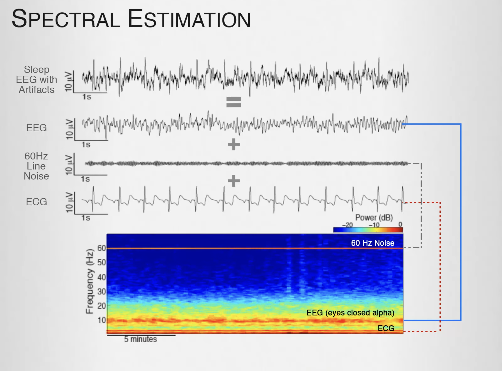

Traditional methods for spectral estimation provided noisy/inaccurate power spectrum estimates; however, advancements in spectral analysis, such as single-taper spectral analysis and even more so multi-taper spectral analysis greatly improve the resolution of power spectrum analysis.

Here is a snapshot of traditional, single-taper, and multi-taper spectrograms

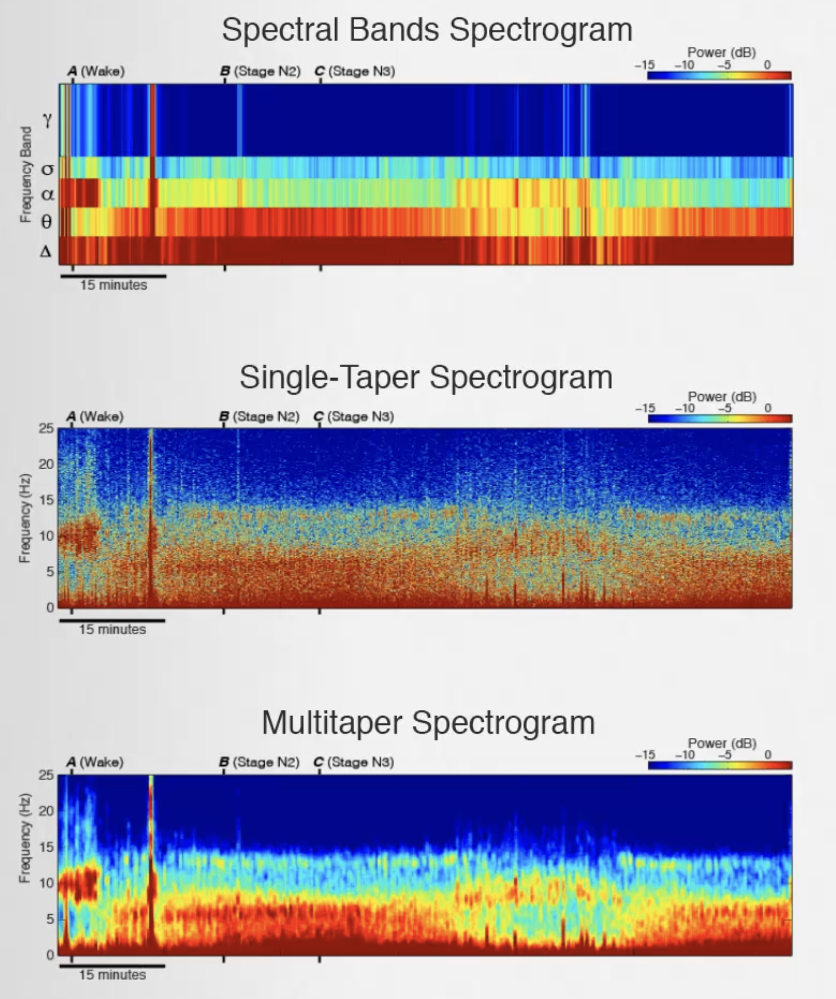


### Sleep Staging 
Sleep staging is a useful but has inherent limitations, including low-resolution, subjectivity (inter-/intra-technicain reliability), time-consuming, and doesn't account for the vast heterogeneity of the sleep EEG activity.

For instance, the black line in the image below represents general EEG brainwave activity, with the red step-wise line representing discrete sleep stages (in 30 second epochs). While scoring sleep stages this way is useful for describing sleep states, but in reality, brain activity is constantly in a state of flux and not restricted to 30 second epochs (e.g., while asleep, you could wake up at any moment!)

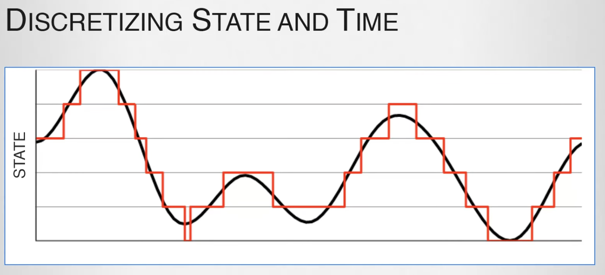


# Wave Properties
This is a quick section for referencing the different properties of a wavelength, which are used to characterize a waveform. 

- **Frequency:** The number of oscillations of a wave per second (measured in Hz).
- **Phase:** Represented by θ (theta) indicating the time of the wave relative to where it is along its sinusoidal cycle. Phase is measured in degrees or radians
- **Amplitude:** The average distance between peak to troughs, measured in microvolts (μV).
- ** Power:** The square of the amplitude. Power is often displayed on a logarithmic scale, in decibels (dB).


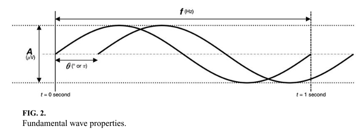


# Section XX: Periodogram and Fourier Analysis
This section deals with the underlying mathematics behind how to get spectral estimation of spectrum powers from EEG data. It is currently being written so this author understands WTF is actually happening with EEG and power spectral analysis via Python. This section will be more important for understanding how to adjust the parameters of power spectral estimation to verify the output is as accurate as possible.

Here is a schematic of the Fast Fourier Transformation, indicating how EEG waveforms move from the time domain to the frequency domain. 

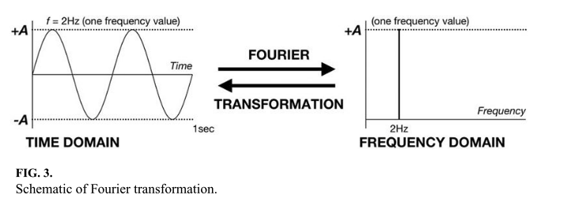

Fourier analysis assumes that any dataset can be broken into a series of pure sinusoids of **infinite length.** In reality, we use finite data.

The simplest method of power spectral estimation (albeit a poor estimator) is the use of a periodogram (see below).

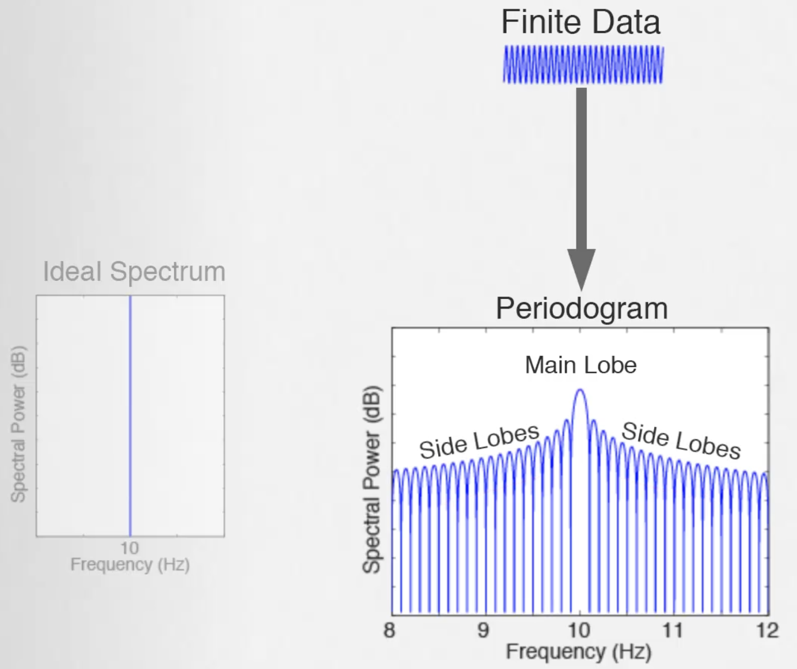

**Note:** The "main lobe" is the actual frequency we're measuring as well as the "side lobes."  

The reason these side lobes occur is because we're dealing with finite data (real world) when fourier analysis assumes infinite data. Think of finite data as infinite data multiplied by a rectangular window where the signal values is 0 except at every point in time except the specific timepoint where we actually observe the data/signal (the rectangular window).

Therefore, when performing Fourier analysis on finite data, the analysis ends up combining the power spectrum for the infinite sinusoid and the rectangular window.

As a result, these side lobes occur due to the sharp changes in the data during the rectangular window (period of observation). 

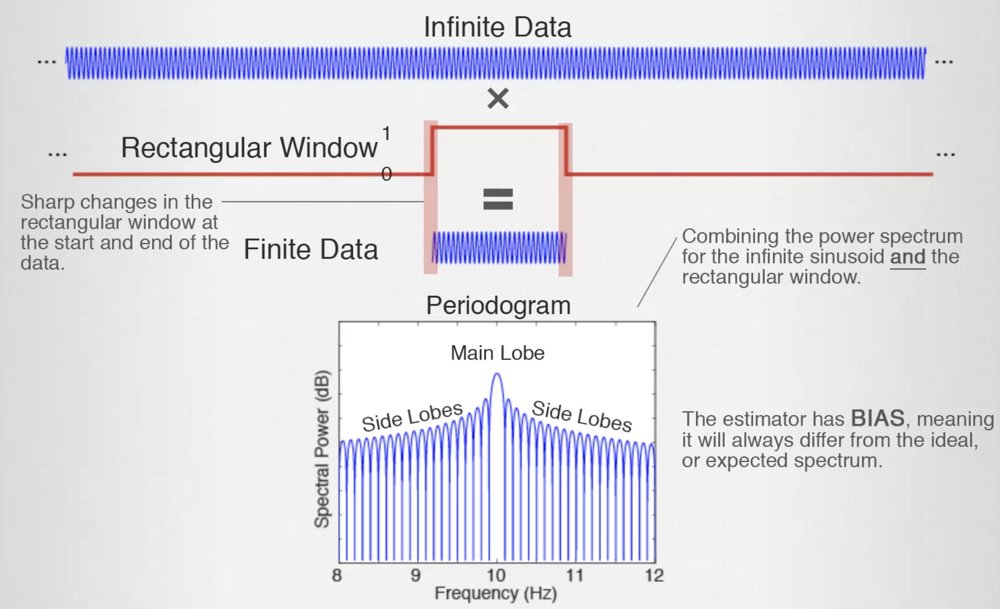

## Periodogram Bias
Since a perfect spectrum data point is not achievable (as we live in the real world with finite data), every power spectrum estimator technique has **bias**, meaning the output will differ from the ideal/expected spectrum. This bias is particularly poor when data length is short.

**Note:** Due to this bias, fine-tuning the power spectrum estimation methods (i.e., Python code arguments and "clean-er" data) will help minimize the bias/estimation error.

There two types of bias that occur: narrowband bias (main lobe), and 

**Narrowband bias (main lobe)**:  
- Any frequency peak with a bandwidth smaller than the main lob will be expanded to have a greater width.
- If multiple frequency peaks occur within this bandwidth, they'll be combined and only appear as a single peak.

This determines the frequency resolution—the minimum peak width observable for the spectrum analysis. 

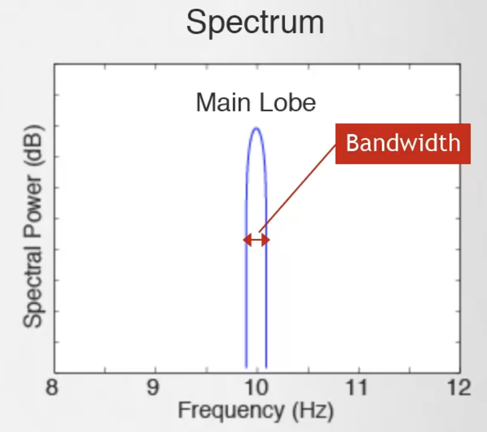

**Broadband bias (side lobes)**:
These sidelobes act like antenna that transmit the expected middle frequency (main lobe) outwards into false frequencies. This is known as **Spectral "leakage."**

## Improving Bias

Recall that the sidelobes of the periodogram appear partially due to the squared cut-off edges of the observation window. 

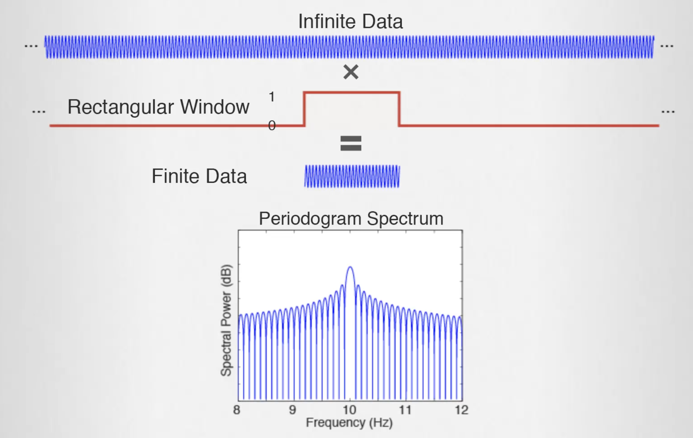

One option of improving bias is by altering/smoothing the cut-off edges of the observation window, known as a **taper function.**

There are multiple types of taper functions. The one shown in this picture is known as a Hamming window. If you multiple infinite data by a taper function, you get tapered data...

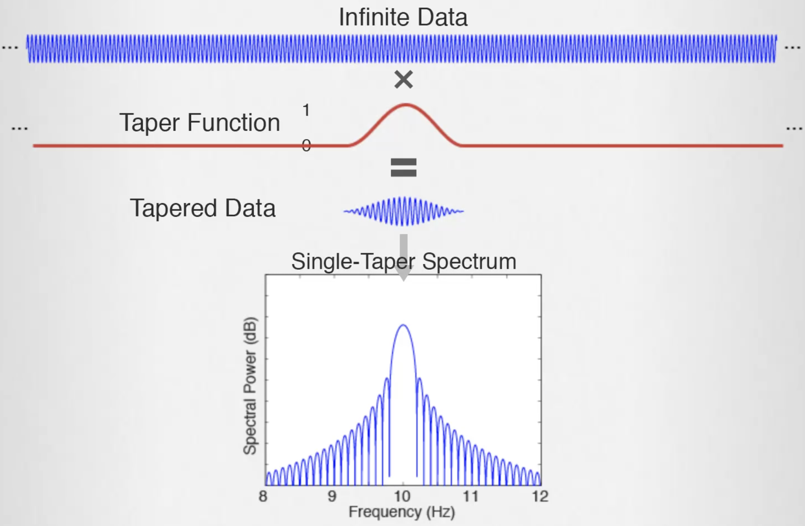

This taper function pushes down on the sidelobe, thereby reducing the, albeit at the trade-off of increasing the narroband bias. (There are apparently ways of understanding and controlling for how wide the main lobe will be, if you understand your frequency resolution and choose parameters wisely.)

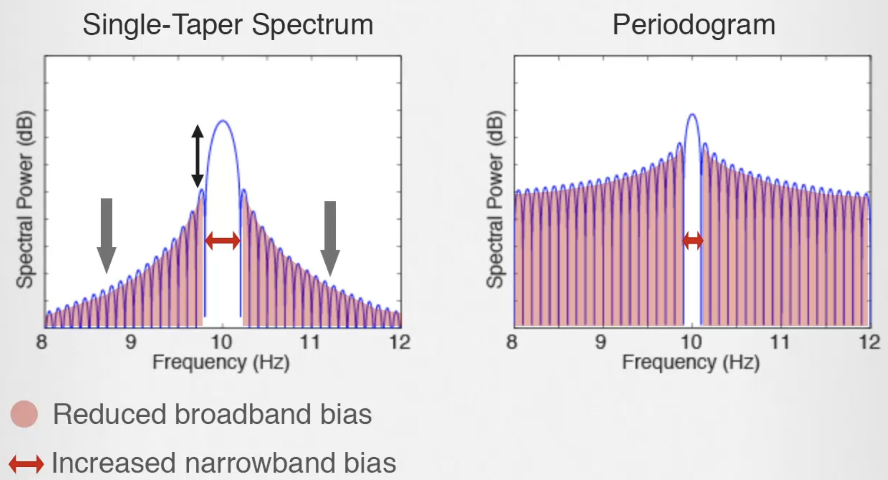

**Variance:** Periodograms and single-taper spectrum have high variance (noise) and no matter how much data is collected, the variance cannot be reduced using these methods...Enter multitaper spectral analysis

## Multi-taper Spectral Analysis
Ultimately, we want to simultaneously reduce both **bias** and **variance** (noise), which can be accomplished using multi-taper spectral analysis. Shoutout to David Thomson for developing multi-taper spectral analysis.

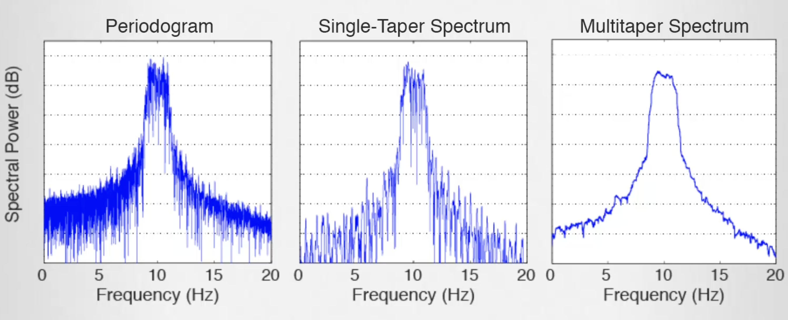

Normally, the variance of a dataset could be reduced by performing multiple independent trials of an experiment and taking the average value (hence why bigger sample sizes are valuable.) However, this isn't possible with EEG data in which you'll likely have one recording of the data per person, per condition.

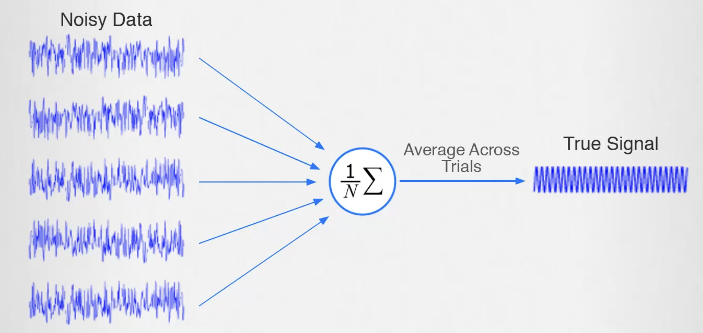

The application of multiple tapers (hence "multi-taper" spectral analysis) can mimic this repeated measures effect through the application of multiple tapers that are orthogonal to each other, then averages their spectral outputs.

As previously mentioned, there are taper methods that can be used to smooth spectral data. Discrete prolate spheroidal sequences (DPSS tapers) are a special class of taper functions with two important properties that make them special:

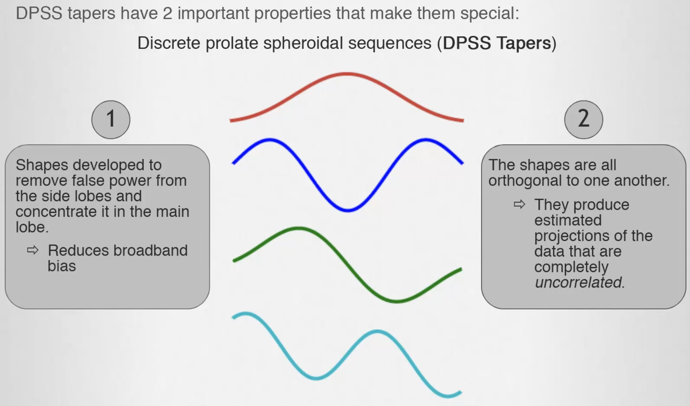

1. The shapes of these tapers were developed to remove false power from the sidelobes, reducing broadband bias.
2. These tapers are orthogonal to one another so that they're uncorrelated estimated projections of the data (spectral power) than then be averaged together to reduce variance.

Here is what the steps of multitaper spectrum analysis look like all together:

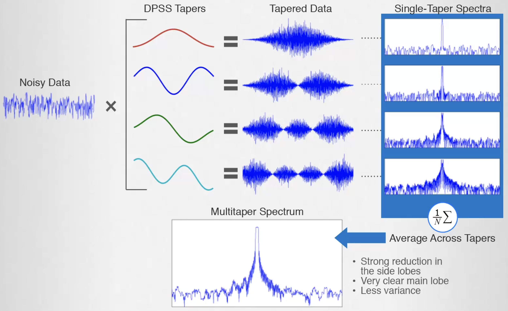

So simply put, all you need to do to generate a multitaper spectrum is:
1. Generate a set of DPSS tapers.
2. Estimate single-taper spectrum for each piece of tapered data.
3. compute the mean single-taper spectrum.

There are open-source, freely available code/walkthroughs that allow you to compute multitaper spectrum using languages like Python, R, C, and MATLAB (this authors is attempting it via Python.)

### Multi-taper spectrum parameters

- N = the size of the data window (in seconds)
- Δf = the frequency resolution
- TW = the time-halfbandwidth product
- L = the number of DPSS tapers to use
 
**How to figure out what these parameters should be?**

First, to establish the window size (N) and frequency resolution (Δf), figure out these assumptions:

**Assumption 1: Stationarity**
- **How fast does the signal change?** 

In the case of EEG, the size of the data window is 30 seconds, so 30 seconds.

**Assumption 2: Frequency Resolution**
- **What is the smallest distance between frequency peaks we want to observe?**
  - We don't want to observe frequencies closer together than 1 Hz, so frequency resolution (Δf) = 1 Hz

After calculating N and Δf, time-halfbandwidth (TW) can be calculated:

```
Time-halfbandwidth formula:

TW = (NΔf) / 2

so , 

((30s)* (1 Hz)) / 2 = 15 Hz-s

TW = 15 Hz=-s
```

Then, with the first three parameters determined, you can determine the number of DPSS tapers to use (L) via:

```
L = [2TW]-1

[2*15] - 1 = 29

L = 29 DPSS tapers

Note: The brackets indicate rounding down to the closest integer
```

You need to select parameters in a principled way, based on what you'd expect to observe, in order to balance between reduced variance and adequate frequency resolution. Fortunately, EEG occurs in 30-s epochs (pre-determined for you) and a 1 Hz frequency resolution would be the most logical for sleep EEG analysis (i.e., being able to determine two waveforms apart down to 1 Hz different), these parameters are all essentially pre-determined for sleep EEG analysis. Hurray! 

# Setting up EEG Analysis in Python

## Python Dependencies
- MNE
- YASA (Yet Another Sleep Algorithm)
- EDF Browser

# Importing Data
### EEG.edf file
Sleep Profiler (edf) study file


### Hypnogram 
Sleep Profiler (csv) study file

## Pre-processing Data

MNE artifact detection overview [documentation](https://mne.tools/dev/auto_tutorials/preprocessing/10_preprocessing_overview.html)


## Spectral Analysis
Yasa.plot_spectrogram() is the method, which will plot a multitaper spectrogram of the data. 

Recall that the which parameters need to be specified for multitaper analysis are: 
- N = the size of the data window (in seconds)
- Δf = the frequency resolution
- TW = the time-halfbandwidth product
- L = the number of DPSS tapers to use

For the Sleep Profiler EEG data: 
- N = 30 (data is plotted in 30-s epochs)
- Δf = 1
- TW = 15
- L = 29

yasa's [plot_spectrogram documentation](https://yasa-sleep.org/generated/yasa.plot_spectrogram.html#yasa.plot_spectrogram) doesn't require much input beyond:
- Specifying the single-lead EEG to plot, 
- The sampling frequency (sf),
- The hypnogram (can be optional),
- win_sec: the sliding window time frame (30 seconds is default, so doesn't have to be explicitly called).
- fmin, fmax: the lower and upper frequency displayed on the spectrogram. Default 0.5 to 25 Hz (also optional for current use, I believe).


```python
## change these settings prior to plotting spectrogram, as needed

## EEG4 is channel selected as it has best agreement with hypnogram data
data_chan = raw.get_data(picks='EEG4')[0]

## sampling frequency (sf), for Sleep Profiler headband, frequency = 256 Hz
sf = raw.info['sfreq']

## Call the plot_spectrogram function
## hypno = hyp (previously made alias for the hypnogram.csv data)
## win_sec not specified since 30-s is the default
yasa.plot_spectrogram(data_chan, sf, hyp)

```
Here is the plot of the spectrogram code above: 


Voilá!


## Sleep Spindle Analysis

YASA.spindles_detect [documentation](https://yasa-sleep.org/generated/yasa.spindles_detect.html#yasa.spindles_detect)

```python
sp = yasa.spindles_detect(
    raw.get_data(picks='EEG4')[0] * 1e6,  # µV, single channel
    raw.info['sfreq'],
    hypno=hyp,
    include=("N2", "N3"),   # N2 and N3 only
    freq_sp=(12, 15), # spindle frequency band — can adjust for slow (11-13Hz) vs fast (13-15Hz)
    freq_broad=(1, 30),
    min_distance=500, # ms between spindles
    # coupling=True,    # spindle-SO coupling
)
sp_summary = sp.summary(grp_stage=True)  # aggregate by sleep stage
## print(sp_summary) ## see next window

```
**Output:**
```

Stage	2	3
Count	1105.000000	165.000000
Density	6.038251	1.250000
Duration	0.935276	0.830658
Amplitude	38.269948	46.292419
AmpFiltered	24.256031	28.684517
RMS	8.326675	10.417635
AbsPower	1.830783	1.964526
RelPower	0.459964	0.378663
Frequency	12.471021	12.383619
Oscillations	11.415385	10.006061
Symmetry	0.502539	0.485398
```


[Sleep spindle temporal dynamics toolbox](https://prerau.bwh.harvard.edu/sleep-spindle-dynamics-toolbox/) (Prerau lab)


## Repairing Artifact

Independent Component Analysis in MNE [documentation](https://mne.tools/dev/auto_tutorials/preprocessing/40_artifact_correction_ica.html#tut-artifact-ica)


### Sleep Profiler Study Editor Tool


# References

**Sleep EEG Multitaper Spectrogram tutorial** Prerau Lab YouTube series. 

[Video 1: An Introduction to Spectral Analysis](https://www.youtube.com/watch?v=OVsZJLtzNsw) ~16 minutes

[Video 2: Methods of Spectral Estimation](https://www.youtube.com/watch?v=6qTD7qtHius) ~16 minutes

[Video 3: Characterizing Sleep with the Multitaper Spectrogram](https://www.youtube.com/watch?v=g_MkonANaWk) ~20 minutes


Dr. Michael Prerau, PhD is currently an Associate Professor at Harvard Medical School; a neuroscientist and Director of the Neurophysiological Signal Processing Core Division of Sleep and Circadian Disorders.

[Prerau Lab Website](https://prerau.bwh.harvard.edu/multitaper/)

- [Prerau Lab walkthrough on multitaper spectral estimation](https://prerau.bwh.harvard.edu/multitaper/)


