# Sleep Profiler EEG scoring Walkthough.

**Overview:** 

This walkthrough is built from a combination of references—including the AASM sleep scoring manual (2012) and according to Sleep Profiler supplemental materials—and is meant to serve as an overview and standard operating procedure (SOP) for how to:
- View, export, and consolidate EEG data collected by the Sleep Profiler headband.
- Review/edit auto-scored EEG data from the Sleep Profiler headband according to AASM Sleep scoring manual (2012) and Sleep Profiler supplemental resources. 

## Table of Contents
- [Sleep Profiler EEG scoring Walkthough.](#sleep-profiler-eeg-scoring-walkthough)
  - [Table of Contents](#table-of-contents)
  - [Accessing Sleep Profiler Data.](#accessing-sleep-profiler-data)
  - [Viewing the Hypnogram.](#viewing-the-hypnogram)
- [Scoring sleep stage criteria.](#scoring-sleep-stage-criteria)
  - [Wake stage criteria:](#wake-stage-criteria)
  - [Stage N1 criteria:](#stage-n1-criteria)
  - [Stage N2 criteria:](#stage-n2-criteria)
  - [Stage N3 criteria:](#stage-n3-criteria)
  - [Stage R (REM) criteria:](#stage-r-rem-criteria)
    - [Detecting Artifact.](#detecting-artifact)
- [Sleep Scoring Workflow: The Actual "How to."](#sleep-scoring-workflow-the-actual-how-to)
    - [How to assign or edit an epoch's sleep stage:](#how-to-assign-or-edit-an-epochs-sleep-stage)
    - [Scoring the Data Workflow:](#scoring-the-data-workflow)
- [Sleep Staging Examples.](#sleep-staging-examples)
- [Helpful Resources.](#helpful-resources)
- [References.](#references)

## Accessing Sleep Profiler Data.
1. Log in at [Sleep Profiler Website](https://cportal.b-alert.com/sleep-profiler/login) using the credentials provided by the lab group. 

2. Enter in the information (e.g., first or last name) of the file you are trying to locate.
   
3. Select the appropriate file and then click 'edit study' from the toolbar and select the EEG study file you'd like to view.

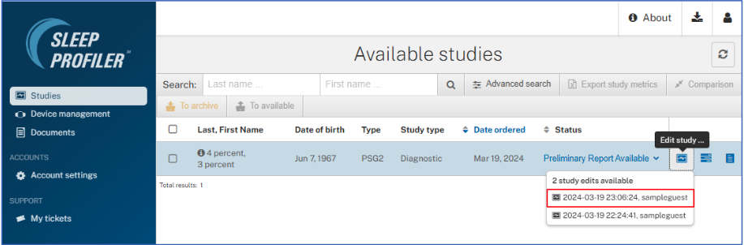

**Important:** The EEG file should open automatically as a new window but you will need to have the latest version of Java downloaded. If it doesn't you may need to download both the Sleep Profiler Launcher AND update Java. 

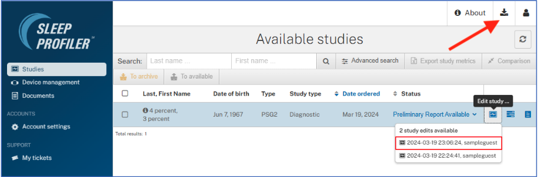

This page should show up after clicking the download icon from the previous screen. Select the appropriate SleepProfilerLauncher to download based on your operating system. 

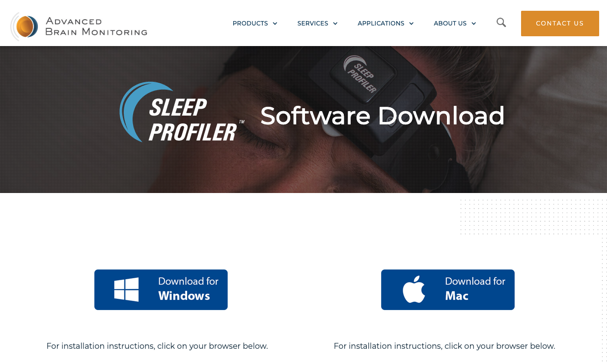

This software runs in the background of your computer and should allow the auto-staged EEG data to pop up automatically after you click the appropriate file.

## Viewing the Hypnogram.
Here is what the study editor tool window looks like upon opening:

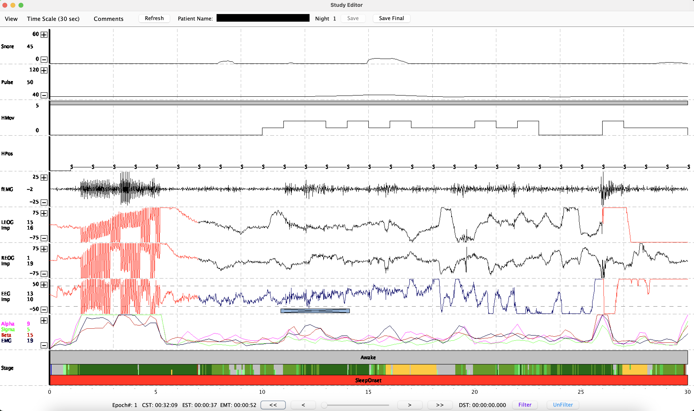

Note the **'View' 'Time Scale'** and **'Comments'** tabs at the top, which can be used to modify your viewing of the data. For instance, here is the same EEG file when the time scale is changed from 30 seconds to 'Full Night:'

**Tip:**
You can quickly alternate between 30-s (one epoch) and 10-min (20 epoch) views using the 'page up/down' keys.
   - For Mac users, page up/down keys are the function (fn) key + up/down arrow, respectively.

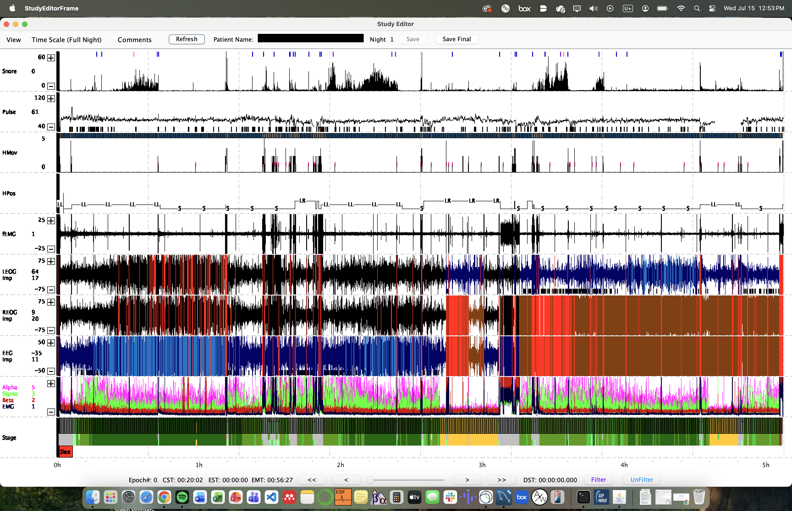

Here is a less 'chaotic' EEG display with labels for on each channel. 

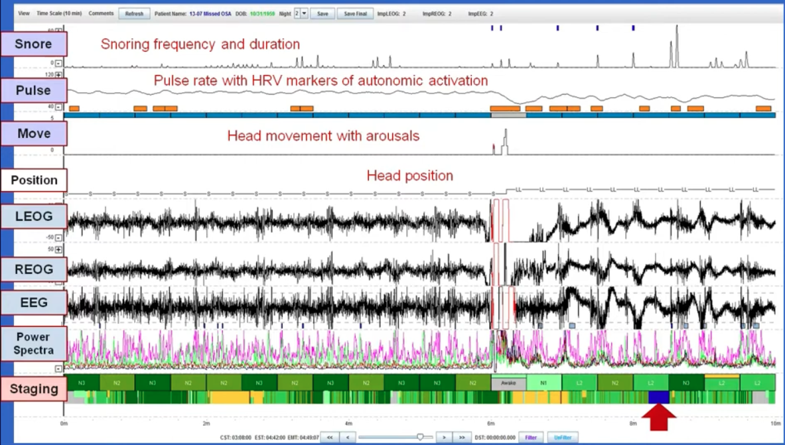

Note the **"staging display"** at the bottom. The upper portion of the staging shows you epoch-by-epoch, depending on the time scale you are currently working in. For instance, the 10-minute timescale selected in this image allows you to view 20 epochs (30-sec each) at once. 

The bottom portion of the staging area shows the entire night of sleep, with the blue bar representing your specific point-of-view for this EEG recording. 

**Other study editor tool 'features' includes:**

**Signal filter/unfilter**:
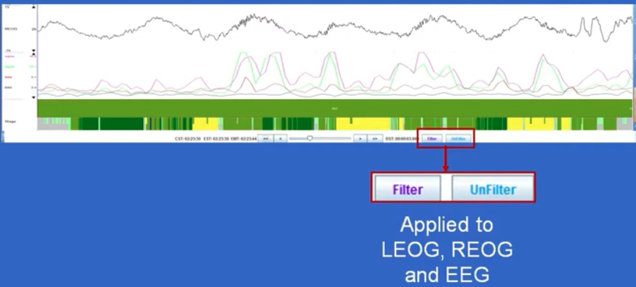 

Both with a 0.1 Hz high-pass filter applied. When more than three seconds in a 30-s epoch staged N2 or N3 exceeds the presentation range, the sweath or breathing artifact is removed with a band-stop filter to all three channels (filter 'ON'). You can also toggle this filter on/off using the up/down arrow (hotkey) or via their icons in the lower right of the study editor tool. 

**Signal defaults:** 

Signal defaults are the ranges of the dashed lines on the EOG and EEG signal chanels. Default ranges are:
- ± 75 μV for EOG
- ±50 μV for EEG signals 

**Impedence values:** 
Impedence values can be used to assist with identifying artifact (high impedence = bad). 
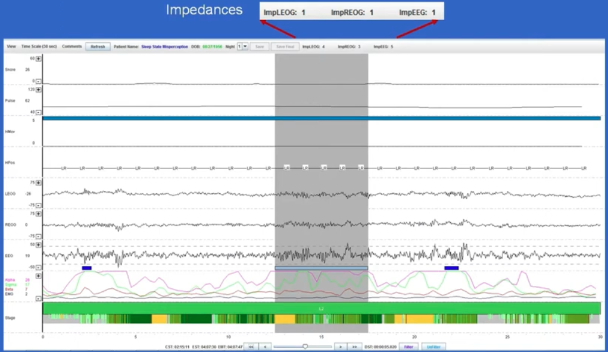

**Time display**: 

There are three times displayed in the lower left of the study editor tool. These times are based on the time from the left edge of the study editor tool display (i.e., start of the study.)
- CST = clock screen time
- EST = elapsed screen time
- EMT = elapsed mouse time

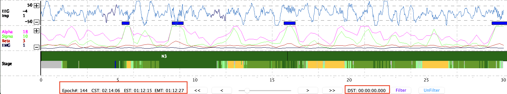

When the left click + drag feature is used to select multiple epochs, the DST (distance of marked region) will tell you the time/distance of the selected region.

# Scoring sleep stage criteria.

Sleep stages according to the American Academy of Sleep Medicine (AASM) includes: 
- Stage W (Wakefulness)
- Stage N1 (NREM1)
- Stage N2 (NREM2)
- Stage N3 (NREM3)*
- Stage R (REM)

**Note:** *N3 represents and replaces the term 'slow wave sleep' (older terminology from Rechtschatten and Kales nomenclature.)

## Wake stage criteria:
Characterized by: 

- **Alpha rhythm:** trains of sinusoidal 8-13 Hz activity recorded over occipital region with eye closure, attenuating with eye opening. 
- **Eye blinks:** conjugate vertical eye movements at a frequency of 0.5–2 Hz present in wakefulness with eyes open or closed. 
- **Reading eye movements:** trains of conjugate eye movements consisting of a slow phase followed by a rapid phase in opposite direction as the subject reads. 
- **Rapid Eye Movement (REM):** conjugate, irregular, sharply peaked eye movements with an initial deflection usually lasting <500 ms. 
- **Slow eye movement (SEM):** conjugate, reasonably regular, sinusoidal eye movements with an initial deflection lasting >500 ms. 

**Wake stage notes:** 

Score epochs as stage W when more than 50% of the epoch has alpha rhythm over the occipital region; score epochs without visually discernibe alpha rhythm as stage W if ANY of the following criteria are met: 
  - Eye blinks at a frequency of 0.5–2 Hz
  - Reading eye movements
  - Irregular, conjugate rapid eye movements associated with normal or high chin muscle tone.

## Stage N1 criteria:
Sleep Profiler's algorithm uses detected cortical arousals to score an epoch as stage N1. 

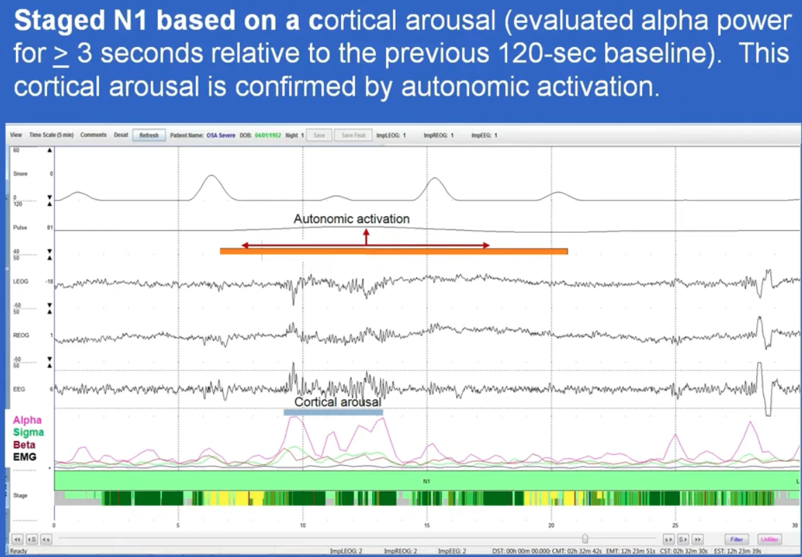

Sleep Profiler also uses identified micro-arousals to stage an epoch as stage N1. 

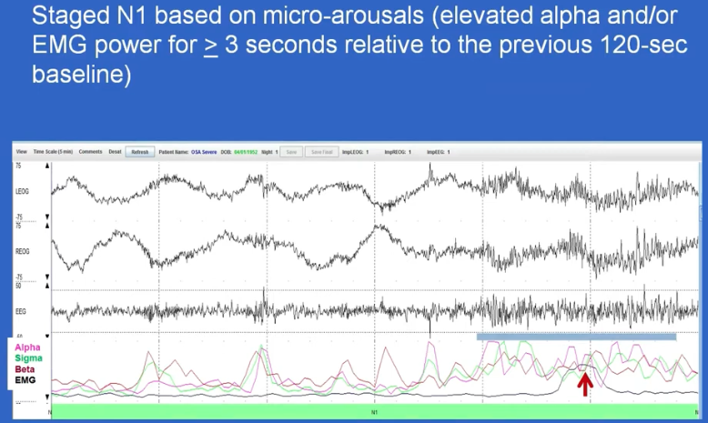

**Here are the official AASM criteria for stage N1:**
- **Slow eye movement (SEM):** conjugate, reasonably regular, sinusoidal eye movements with an initial deflection lasting >500 ms. 
- Low-amplitude, mixed-frequency EEG activity: low-amplitude, predominately 4–7 Hz activity. 
- **Vertex sharp waves (V waves):** Sharply contoured waves with duration <0.5s maximal over the central region and distinguishable from the background activity. These are bilateral, phase-reversing discharges most often seen during the transition stage from N1 sleep, but can occur in either stage N1 or N2 sleep.

Here is a visual of V waves (not Sleep Profiler EEG):
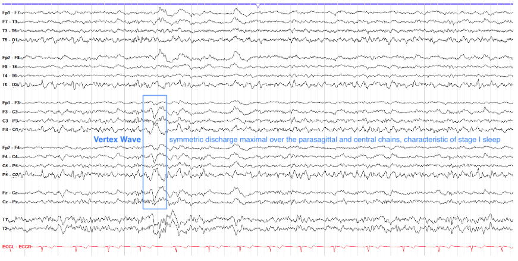

Image source: [LearningEEG.com](https://www.learningeeg.com/normal-asleep)

**Stage N1 notes:** 
- In individuals who generate alpha rhythm, score stage N1 if the alpha rhythm is attenuated and replaced by low-amplitude, mixed-frequency activity for more than 50% of the epoch. 
- In individuals who do not generate alpha rhythm, score stage N1 commencing with the earliest of ANY of the following criteria: 
  - EEG activity in range 4–7 Hz with slowing of background frequencies by ≥ 1 Hz from those of stage W
  - Vertex sharp waves
  - slow eye movements. 

**Additional AASM Stage N1 Notes:**
- Vertex waves may be present but are not required for scoring stage N1. 
- the EOG will often show slow eye movement in stage N1 but these are not requred for scoring. 
- During stage N1, the chin EMG amplitude is variable but often lower than stage W. 
- As slow eye movements often cmmence before attenuation of alpha rhythm, sleep latency may be slightly shorer for some individuals who do not generate alpha rhythms vs. those who do. 

## Stage N2 criteria: 
Characterized by: 

- **K-complex:** A well-delineated, negative, sharp wave immediately followed by a positive component standing out from the background EEG, with total duration ≥0.5 seconds, usually maximal in amplitude when recorded using frontal derivations. For an arousal to be associated with a K-complex, the arousal must be either concurrent with the K-complex or commence no more than 1 second after termination of the K-complex. 

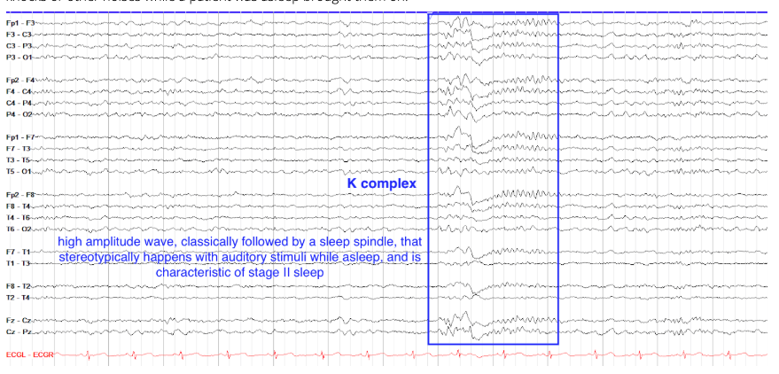 

Image source: [LearningEEG.com](https://www.learningeeg.com/normal-asleep)

- **Sleep spindle:** a train of distinct waves with frequency 12–16 Hz (most commonly 12–14 Hz) with a duration ≥0.5 seconds, usually maximal in amplitude in the central derivations. 

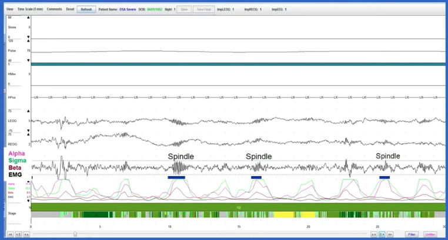 

Per Sleep Profiler: sleep spindles require a spike in power and amplitude of both alpha and sigma waves with low beta-wave and EMG power. The absence of beta and EMG is used to avoid false identification of sleep spindles due to benzodiazapene use (pesudo-spindles). 
- Sleep Profiler will score an epoch with only 1 cortical arousal and ≥1 sleep spindle as N2 (deviation from AASM criteria). 
- Epochs with ≥2 cortical arousals and any number of sleep spindles are staged N1. 

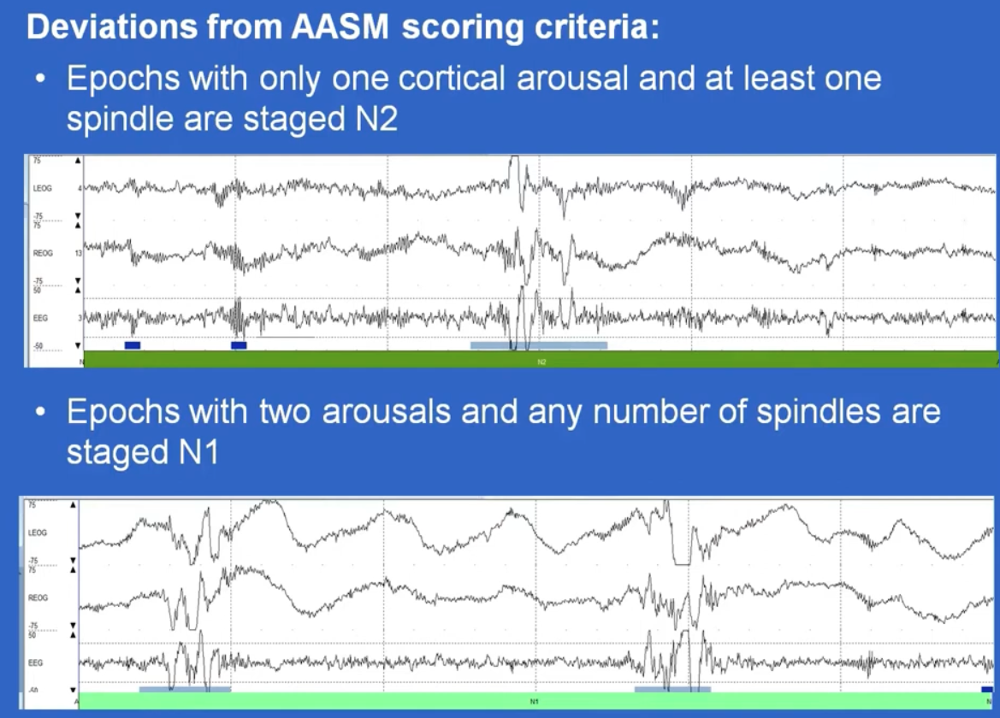

- Sleep Profiler will stage an epoch as light N2 (light green, still counts toward overall N2 time) if K-complexes are consistently elevated or alpha/EMG power is detected.

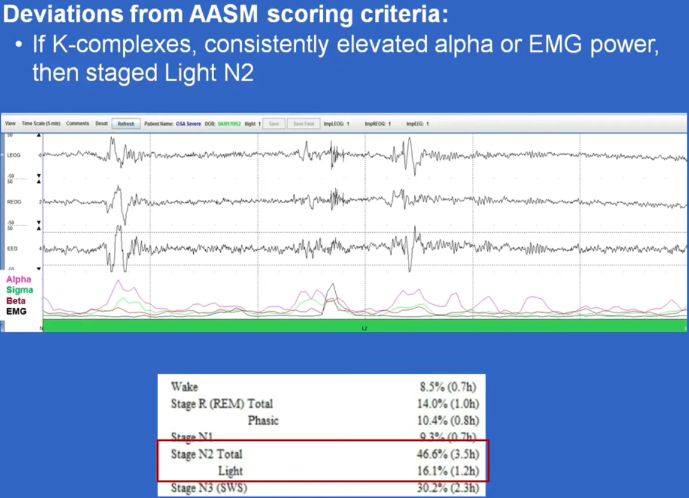

**AASM Stage N2 scoring criteria** (in the absence of criteria for N3) if EITHER OR BOTH the following occur during the first half othe epoch or the last half of the previous epoch: 
- One or more K-complexes unassociated with arousals
- One or mopre trains of sleep spindles.  

**Continue scoring epochs as stage N2** for epochs with low-amplitude, mixed-frequency EEG activity without K complexes or sleep spindles if they are preceded by epochs containning EITHER of the following: 
- K-complexes unassociated with arousals
- Sleep spindles. 

**When to end scoring as stage N2** when ONE of the following events occurs: 
- Transition to stage W.
- An arousal occurs (change to Stage N1 until a K-complex unassociated with an arousal or sleep spindle).
- A major body movement followed by slow eye movement and low-amplitude, mixed-frequency EEG without non-arousal associated K-complexes or sleep spindles (Score the epoch following the major body movement as stage N1; score the epoch as stage 2 if there are no slow eye movements; the epoch containing the body movement is scored using the criteria under heading J, see Fig 5 of AASM manual).
- Transition to stage N3
- Transition to stage R (REM)

## Stage N3 criteria:
Sleep Profiler N3 criteria: 

**Score stage N3 when ≥20% of an epoch consists of slow wave (delta) activity, irresepctive of age.** Sleep Profiler indicates stage N3 will be auto-scored when delta activity is ±30 μV.

**Note:** AASM  defines slow wave activity as: waves of frequency 0.5–2 Hz and peak-to-peak amplitude >75 μV. 

- K-complexes would be considered slow waves if they meet the definition of slow wave activity. 
- Sleep spindles may persist during stage N3 sleep. 
- Eye movements are not typically seen during stage N3 sleep. 
- In stage N3, the chin EMG is of variable amplitude, often lower than in Stage N2 and sometimes as low as in stage R. 

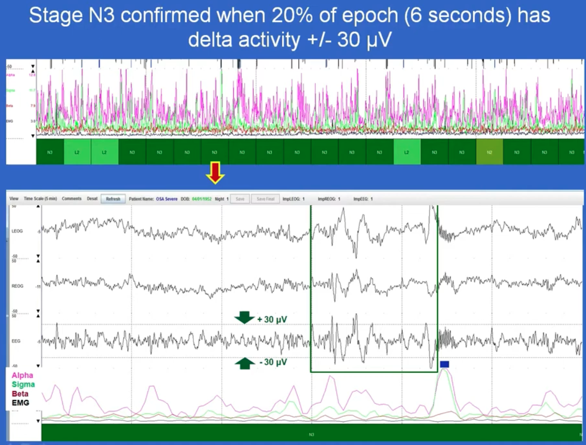

**Note:**
- Sleep Profiler will detect cortical arousals during N3 and flag them in the arousal index but will not score the stage as N1 (epoch will remain staged as N3; AASM scoring criteria deviation).

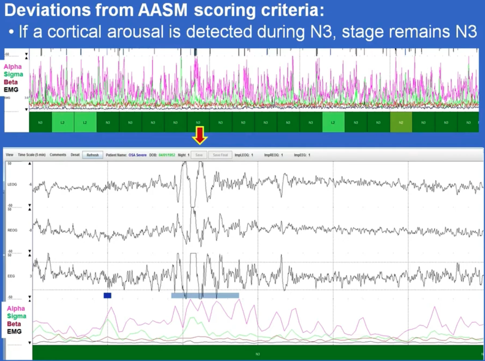

## Stage R (REM) criteria:
- Rapid Eye Movement (REM): conjugate, irregular, sharply peaked eye movements with an initial deflection usually lasting <500 ms. 
- Low chin EMG tone: Baseline EMG activity in the chin derivation no higher than in any other sleep stages and usually at the lowest level of the entire recording. 
- Sawtooth waves: trains of sharply contoured or triangular, often serrated, 2–6 Hz waves maximal in amplitude over the central head regions and often, but not always, preceding a burst of rapid eye movements. 
- Transient smooth muscle activity: Short, irregular bursts of EMG activity usually with duraition <0.25 seconds superimposed on low EMG tone. The activity may be seen in the chin or anterior tibial EMG derivations as well as in EEG or EOG deviations, the latter indicating the activity of cranial nerve innervated muscles (i.e., facial and scalp muscles). The activity is maximal in association with rapid eye movements. 

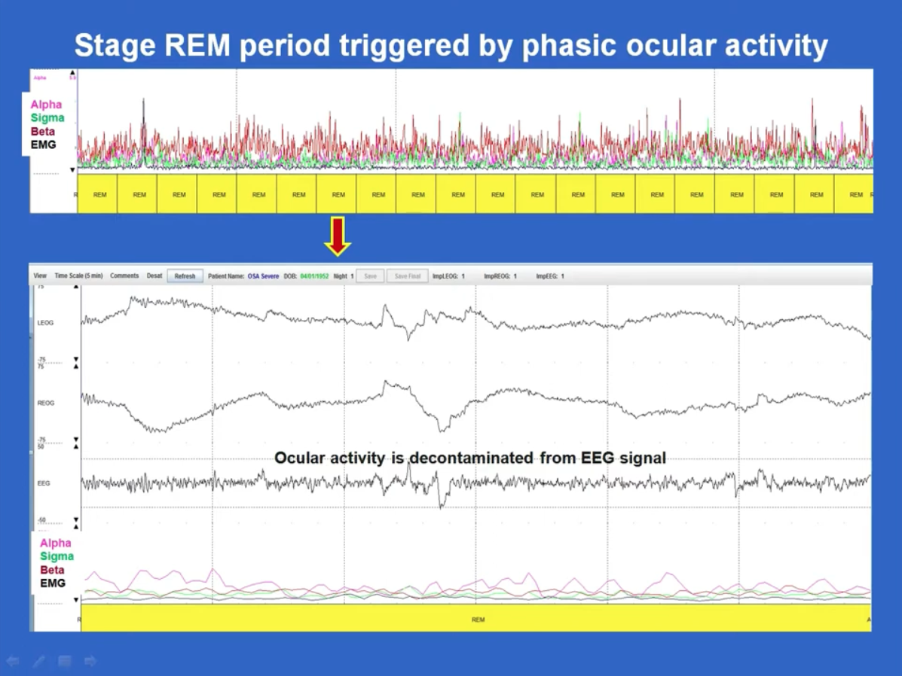

- Sleep Profiler will presume beta-bursts to be 'tonic REM' (deviation from AASM scoring criteria). 
  
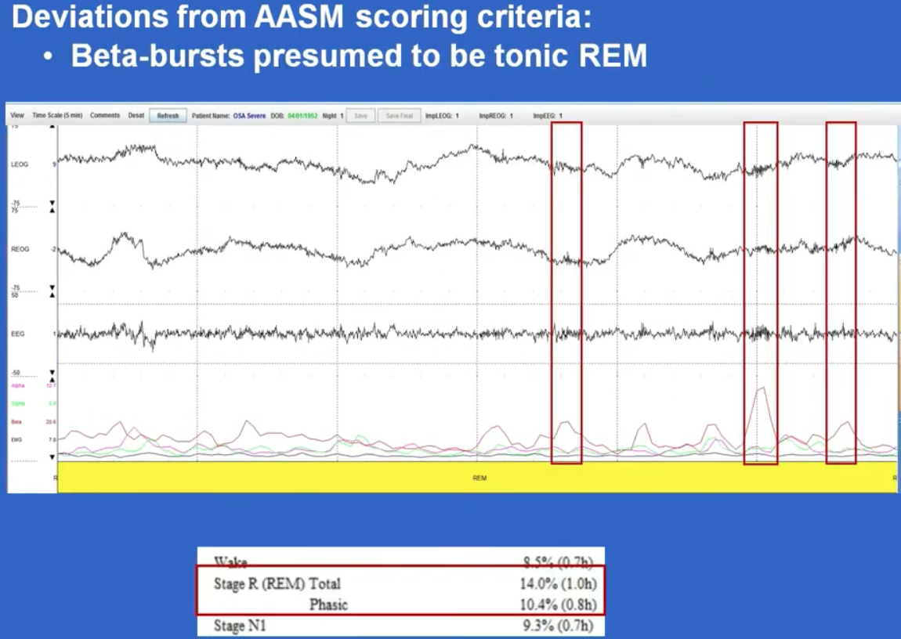

**Score stage R in epochs with ALL of the following criteria:** 
- Low-amplitude, mixed-frequency EEG
- Low chin EMG tone*
- Rapid eye movements

***Note:** at the time of writing this SOP, EMG tone has not been captured using the sleep profiler devices. 

- Sleep Profiler auto-staging will automatically score the first epoch after an awake as stage N1 unless there is a sleep spindle presence. 

- Epochs with gross EMG activity will be staged as awake despite the potential for more than half (>50%) of the epoch showing REM activity.

### Detecting Artifact.
- Signal segments with artifact (poor connection) are colored red. If EEG has excessive artifact, Sleep Profiler will attempt to use the LEOG/REOG signals to stage. 
- When phasic activity exceeds ±100 μV with sharp edges to the waveform, this signal is detected as artifact (noise).

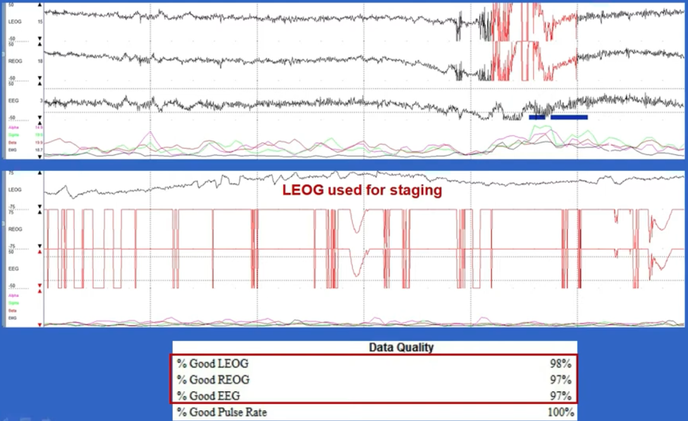

# Sleep Scoring Workflow: The Actual "How to."
A few notes prior to reviewing EEG epoch data: 
- The first epoch in a study is always staged as 'awake.' 
- Sleep onset is considered the start of the first epoch scored as any stage other than W (for most individuals, this will be the first epoch of stage N1). 
- The first epoch after "awake" is always staged as N1 unless there is the presence of a sleep spindle. 
- If two or more stage criteria co-exist within an epoch, score the epoch as the stage comprising the largest portion of the epoch.
- "End of study" marker can be used to mark start + end of data collection period, in case participant leaves EEG device on after awakening. (Recommended/Good Practice.)

### How to assign or edit an epoch's sleep stage:
- Left 'double-click' to access a specific epoch (for viewing/editing that epoch).
  - Viewing one epoch at a time is particularly helping with identifying the specific epoch in which transitions from one sleep stage to the next occur. 
- Multiple epochs can be edited/scored similtaneously by left click + dragging the cursor to select the desired epochs (see visual below). 
- Right click on a single stage stripe (colored sleep stage block) to edit the assigned stage for that epoch. 

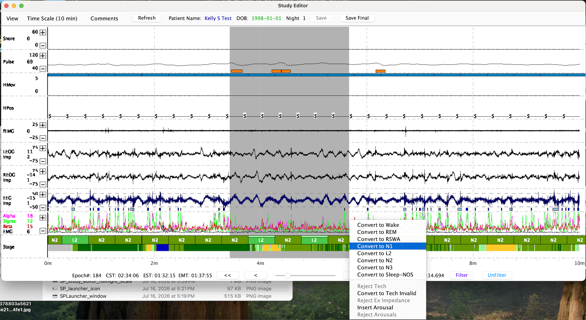

### Scoring the Data Workflow:
1. Locate the epoch where sleep onset was detected by the auto-staging algorithm. Then, find an epoch that is positioned several epochs after the auto-staging algorithm has identified as sleep onset and work on reviewing/editing the assigned "scored" sleep stages from here. (i.e., select an epoch ~5-10 epochs after sleep onset.) 
2. Starting from this epoch, scroll backwards epoch-by-epoch toward sleep onset and verify that these epochs are staged correctly.
   - Modify the stages for any epochs that may have been incorrectly staged by the auto-staging algorithm (revised stages will have a 'T' placed in their staged to denote they were changed by you, the 'Technician.')
3. Continue on through the Sleep-EEG data, scrolling through the data with a timescale of 10-minutes, looking for auto-staged epochs that might seem out of place (review these when found). 
   - Pay close attention to epoch near sleep stage transitions, verify the epochs on either side of the sleep stage transitions are scored correctly. 
4. After sleep you're confident with the transition from wake to sleep onset, proceed through the rest of the EEG data and continue this process.

**Tip:**
   - When the data is consistent upon visual inspection (example of consistent stage N3 sleep below), you can assume the auto-staging correctly scored these sleep epochs and move toward another transition point. 
  
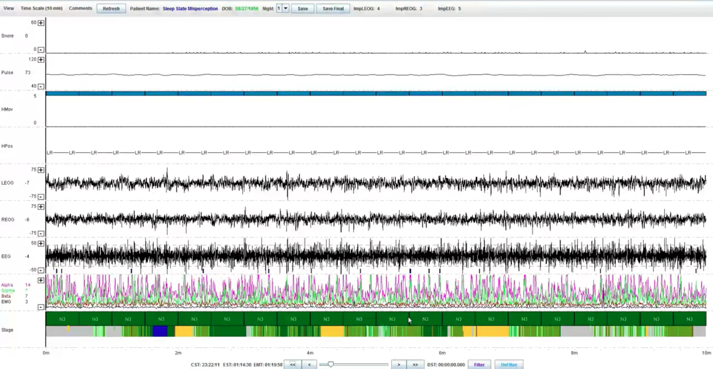

**Note:** You should always confirm transitions between REM and non-REM by clicking on a REM epoch and verify that eye movements (LEOG/REOG) are present in at least one epoch of the REM block of sleep. Below is an example of a N3-to-REM transition point.

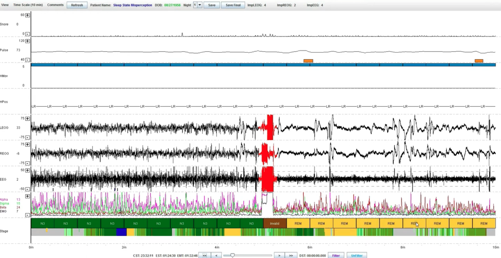

Note the phasic ocular activity ("phasic ocular changes/movements") detected on the LEOG/REOG indicative of phasic REM.

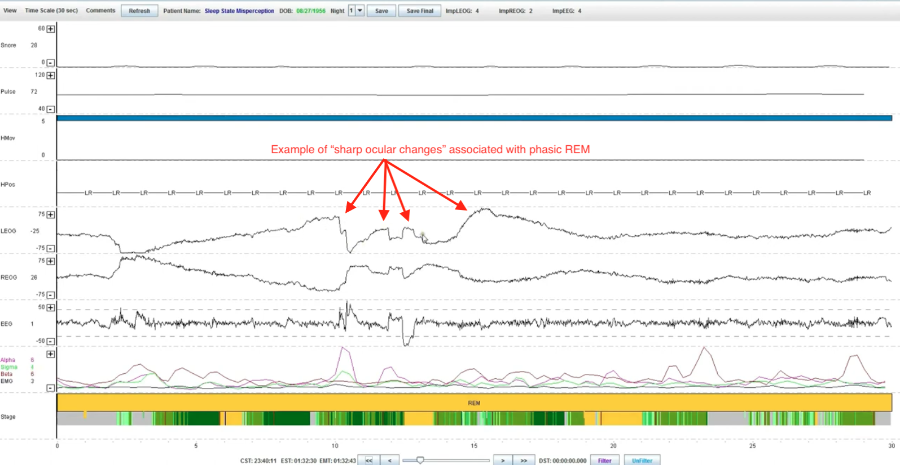

# Sleep Staging Examples.
These images are from the Sleep Profiler walkthrough video (found in helpful links).

This example depicts a random wake epoch in the midst of sleep stages. Notice the snoring cresendo (which precedes the wake epoch), the autonomic activity (increased pulse, orange markers), and the cortical arousal (light blue marker in EEG reading) are indicative that there is an awakening occuring (no change in this score).
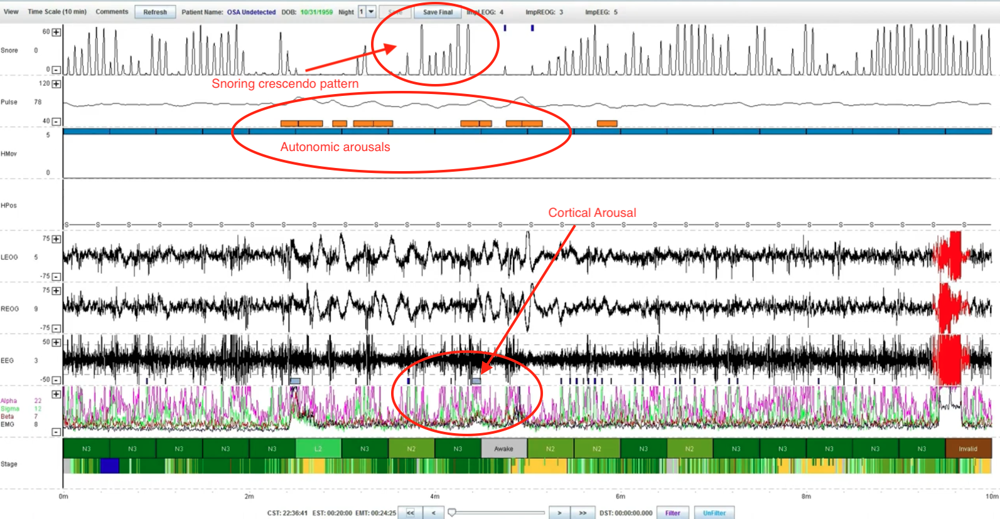

Later on in the same EEG recording, these patterns are observed again as this participant wakes up and falls back asleep.

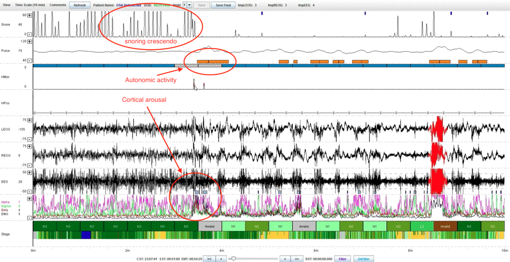

Here is an example where there are N1 epochs in the midst of REM epochs, verified upon inspection by the micro-arousals (viewable on the full screen and in the specific N1 epoch).

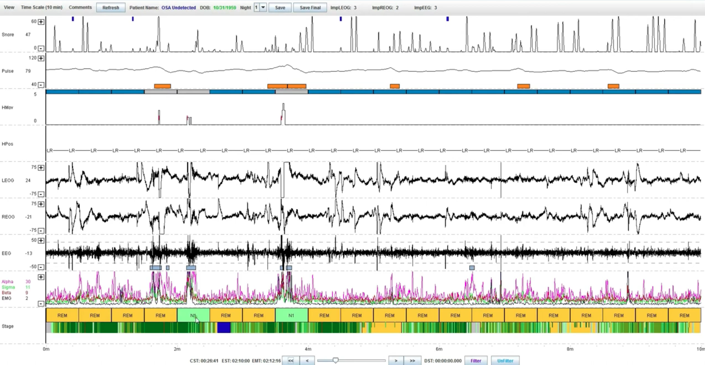 

Here is the close-up view of the left-most N1 epoch from the previous image:

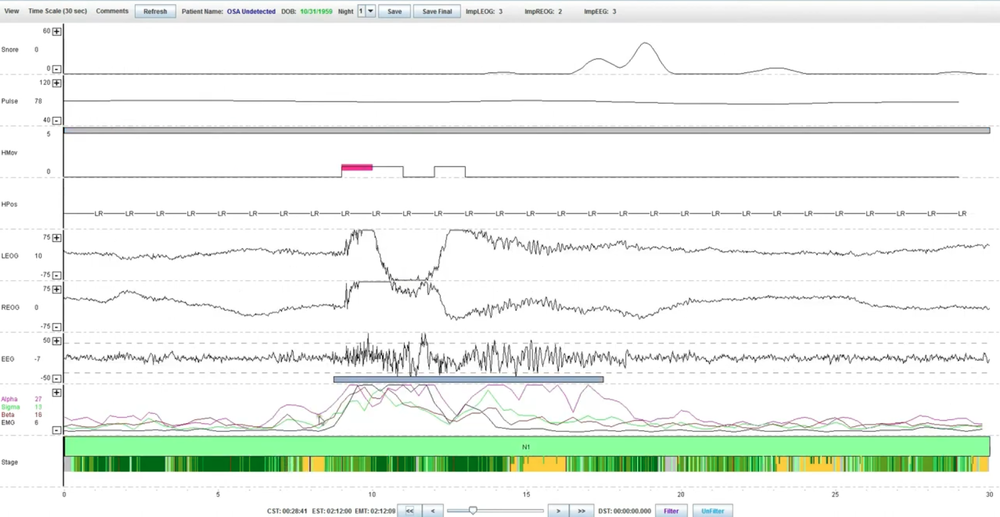

In this example, there are epochs scored as REM with potential non-REM activity. 
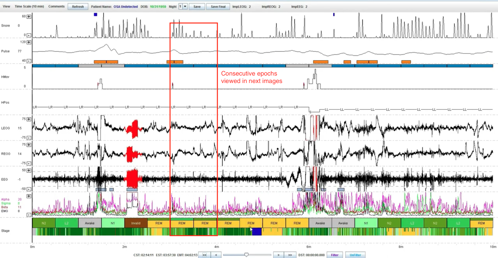

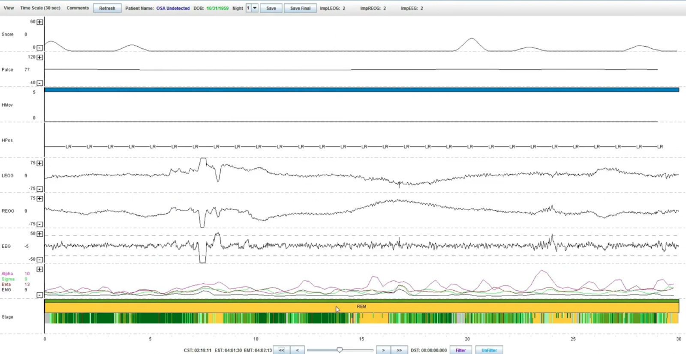

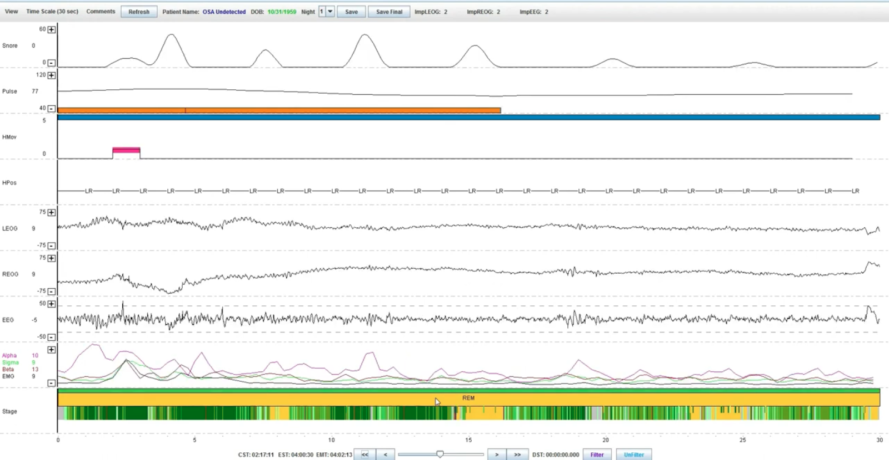
 

In this example, There's a random N3 in the midst of some awakendings, but upon further inspection, this epoch does fit the criteria for N3.

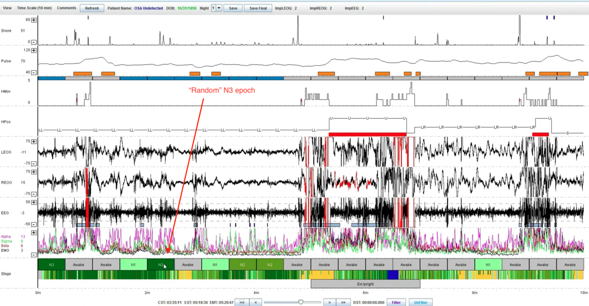 
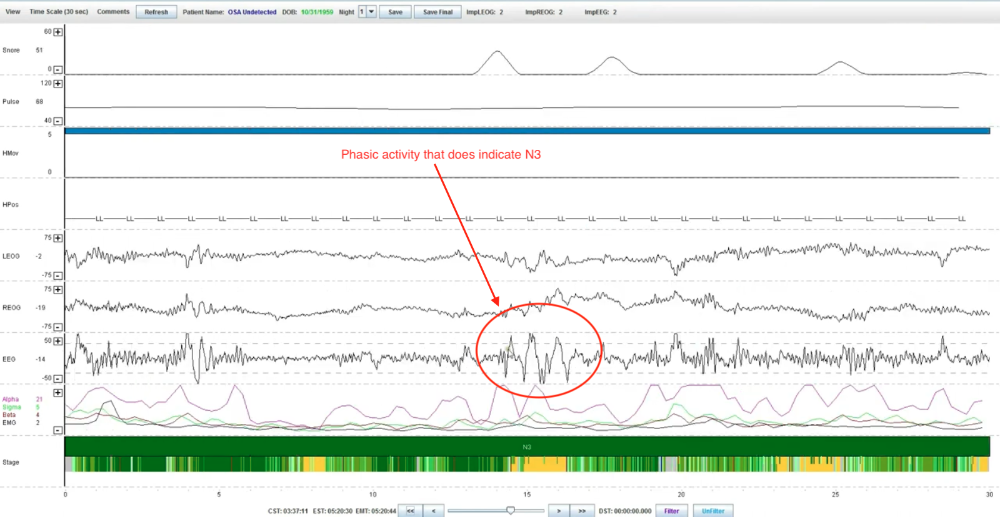

Here is an instance where an epoch was scored REM with partial N3 status. The close up of this epoch shows large waveforms. Per the video walkthrough, "this may seem counterintuitive, but large phasic activity after de-contamination can leave large amplitude waves that exceed the ±30 μV range (N3 criterion) causing an epoch to potentially be mislabeled as N3. 

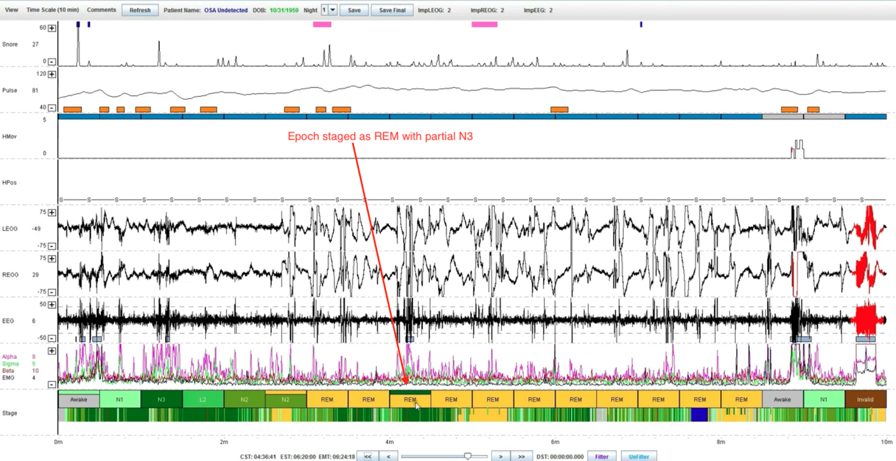
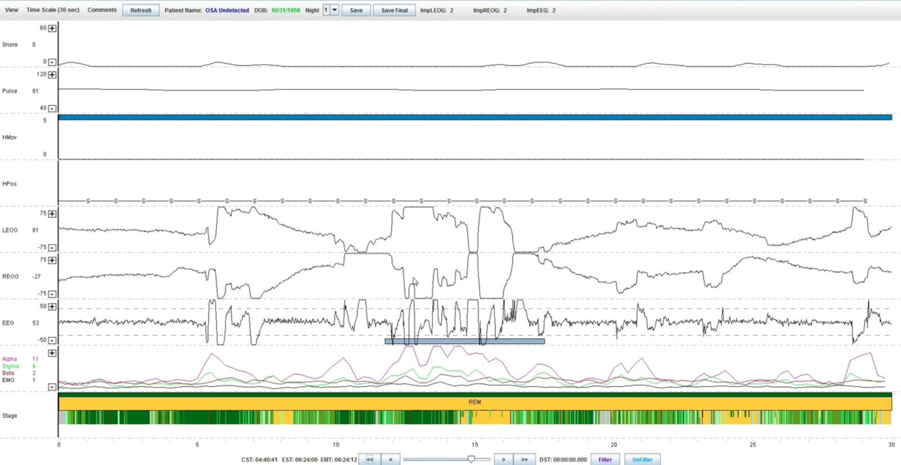

# Helpful Resources.
- [Visual Confirmation of Auto-detected Sleep Staging](https://www.youtube.com/watch?v=CN-6vvvXdwI) (~25-min length)
  - This is the full walkthrough of the Sleep Profiler study editor tool from the company itself.
  - At around minute 9, this video will start to go through an actual walkthrough of scoring study data.
   
  - [Visually Inspect hypnogram](https://www.youtube.com/watch?v=7M5b_Sb_g7Y)
    - This is just the criteria for scoring stages from the previous video (~5-min length).

- [Learning EEG.com](https://www.learningeeg.com/)
  - A self-guided course and atlas regarding sleep stages with visuals of the various waveform phenomena.

# References.

1. Berry RB, Brooks R, Gamaldo CE, Harding SM, Marcus CL, Vaughn BV and Tangredi MM for the American
Academy of Sleep Medicine. The AASM Manual for the Scoring of Sleep and Associated Events: Rules,
Terminology and Technical Specifications, Version 2.0. www.aasmnet.org, Darien, Illinois: American Academy of
Sleep Medicine, 2012.

**Note:** This the official AASM manual for scoring of sleep and associated events, updated in 2012. (Awaiting most up-to-date version of the manual to update this SOP.)

2. Walsleben JA, Kapur VK, Newman AB, Shahar E, Bootzin RR, Rosenberg CE, O'Connor G, Nieto FJ. Sleep and reported daytime sleepiness in normal subjects: the Sleep Heart Health Study. Sleep. 2004 Mar 15;27(2):293-8. doi: 10.1093/sleep/27.2.293. PMID: 15124725.

**Note:** This is the reference for which SleepProfiler uses to calculate normative values in their device data.

3. Levendowski DJ, Ferini-Strambi L, Gamaldo C, Cetel M, Rosenberg R, Westbrook PR. The Accuracy, Night-to-Night Variability, and Stability of Frontopolar Sleep Electroencephalography Biomarkers. J Clin Sleep Med. 2017;13(6):791-803. Published 2017 Jun 15. doi:10.5664/jcsm.6618
**Note:** This is the validation paper for SleepProfiler's autoscoring alogrithm compared against three sleep experts' scoring.